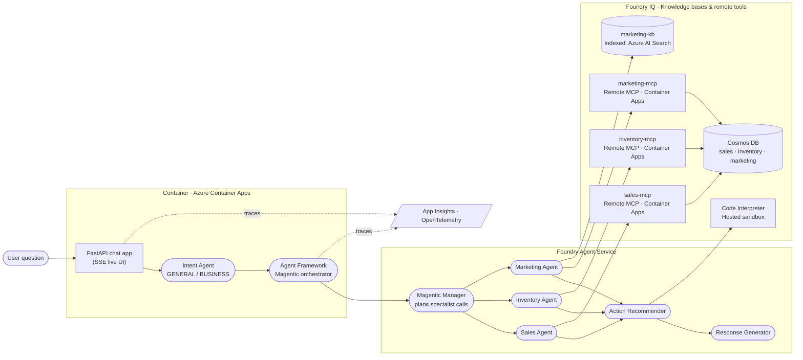

# AI Agents Workshop

> Build an end-to-end, multi-agent assistant for **Zava**, a fictional
> Pacific-Northwest DIY retailer (7 stores + 1 online fulfillment center),
> using:
>
> - **Microsoft Foundry** + **Microsoft Agent Framework** (Magentic orchestration)
> - **Foundry IQ** for grounding · **Code Interpreter** for actions
> - **MCP servers** on **Azure Container Apps** · **Azure Cosmos DB** for data
> - **Evaluations**, **observability**, **guardrails** and **red teaming** in the final modules
>
> You start from a runnable FastAPI chat UI and replace its stub, exercise
> by exercise, with real specialist agents — testing in the browser as you go.

---

## Scenario

You are building an internal assistant for **Zava** store teams and
marketing analysts that answers cross-domain questions and returns one
grounded reply. The signature demo query:

> *“Sales for our Spring Paint Sale in Seattle look soft — which SKUs are
> low on inventory, what does last year's post-mortem suggest, and what's
> the discount-approval policy for the Seattle store manager?”*

| Domain      | Source of truth                                                                                       | Tool surface                                                                                                                |
| ----------- | ----------------------------------------------------------------------------------------------------- | --------------------------------------------------------------------------------------------------------------------------- |
| Sales       | Zava sales transactions per store/category in **Azure Cosmos DB**                                     | **Sales MCP Server** (Container App)                                                                                        |
| Inventory   | Zava per-store inventory + warehouse stock in **Azure Cosmos DB** (SKU pattern `ZV-<CAT>-NNN`)        | **Inventory MCP Server** (Container App)                                                                                    |
| Marketing   | Zava campaigns in Cosmos + briefs/post-mortems in Foundry IQ                                          | **Marketing MCP** + **Foundry IQ KB**, wired into a **Foundry Prompt Agent**                                                |

---

## Reference Architecture

The assistant follows the standard **Foundry IQ + Agent Framework** pattern,
specialised to Zava's three domains.

A full walk-through (component table, exercise map, observability path)
lives in [docs/architecture.md](docs/architecture.md). The diagram is
reproduced here for quick reference:



**How to read it (left → right, matching the reference layout):**

1. **User question** is sent to a **FastAPI chat app** running in **Azure
   Container Apps**. The **Intent Agent** classifies the turn as GENERAL or
   BUSINESS; BUSINESS turns go to the **Microsoft Agent Framework**
   Magentic orchestrator embedded in the app.
2. The Magentic **manager** plans the smallest set of specialist calls and
   dispatches to **Sales**, **Inventory** and **Marketing**. Each
   specialist has its own instructions hosted in Foundry.
3. Every specialist's grounding lives in **Foundry IQ** on the right:
   - **Sales Agent** → `sales-mcp` (remote MCP server on Container Apps,
     backed by Cosmos DB).
   - **Inventory Agent** → `inventory-mcp` (remote MCP server, backed by
     Cosmos DB).
   - **Marketing Agent** → `marketing-mcp` + `marketing-kb` (campaign data
     plus indexed briefs and post-mortems).
4. The **Action Recommender** runs after the specialists and uses the
   **Code Interpreter** to turn their insights into prioritised actions.
5. The **Response Generator** is always called last and writes the single,
   formatted reply shown back in the chat UI.
6. The container, orchestrator and agents all emit traces to **App
   Insights** via OpenTelemetry (Exercise 13).

> The browser UI at `http://localhost:8000` renders this same topology
> live: every node lights up as its agent / tool / KB is invoked (see
> Exercise 07).

---

## Workshop Modules

The workshop is delivered in **7 modules** (plus Setup). Each module groups the
hands-on exercises that build one slice of the end-to-end assistant.

### Setup & Prerequisites
*Goal: get to a working environment and a runnable chat app before any building starts.*

| #  | Exercise | Outcome |
| -- | -------- | ------- |
| 00 | [Setup & Prerequisites](docs/00_setup/00_setup.md) | Local tooling installed; `.env` configured against your Foundry, Cosmos, Search, ACA. |
| 01 | [Scaffold the Chat App](docs/01_chat_app_scaffold/01_chat_app_scaffold.md) | Runnable FastAPI + HTML chat UI talking to a stub backend. |

### Module 1 — Build Your First Agent
*Goal: create and test your first Foundry agent to learn the agent lifecycle.*

| #  | Exercise | Outcome |
| -- | -------- | ------- |
| 02 | [Build Your First Agent — the Intent Detector](docs/02_intent_agent/02_intent_agent.md) | Tool-less classifier that routes GENERAL vs BUSINESS turns. |

### Module 2 — Build the MCP Tools
*Goal: build the three MCP servers and verify every tool with the Inspector.*

| #  | Exercise | Outcome |
| -- | -------- | ------- |
| 03 | [Build the MCP Tools (Sales, Inventory, Marketing)](docs/03_mcp_tools/03_mcp_tools.md) | Three FastMCP servers running locally, tools verified in the MCP Inspector. |

### Module 3 — Give Agents Access to Tools
*Goal: connect Foundry agents to the MCP tools you just built.*

| #  | Exercise | Outcome |
| -- | -------- | ------- |
| 04 | [Sales Agent](docs/04_sales_agent/04_sales_agent.md) | Foundry agent wired to the Sales MCP tool. |
| 05 | [Inventory Agent](docs/05_inventory_agent/05_inventory_agent.md) | Foundry agent wired to the Inventory MCP tool. |

### Module 4 — Add Knowledge with Foundry IQ
*Goal: ground an agent in knowledge with Foundry IQ on top of MCP tools.*

| #  | Exercise | Outcome |
| -- | -------- | ------- |
| 06 | [Marketing Agent (MCP + Foundry IQ)](docs/06_marketing_agent/06_marketing_agent.md) | Foundry Prompt Agent wiring Marketing MCP + a Foundry IQ knowledge base. |

### Module 5 — Orchestrate & Deploy
*Goal: orchestrate the specialists with the Magentic pattern, then ship the app.*

| #  | Exercise | Outcome |
| -- | -------- | ------- |
| 07 | [Magentic Orchestrator](docs/07_orchestrator/07_orchestrator.md) | Plans across the specialists using shared keys; live web UI. |
| 08 | [Action Recommender Agent](docs/08_action_agent/08_action_agent.md) | Turns specialist insights into prioritised actions (Code Interpreter). |
| 09 | [Response Generator Agent](docs/09_response_generator/09_response_generator.md) | Final-answer synthesiser in a consistent Zava voice. |
| 10 | [Deploy the Chat App to Container Apps](docs/10_deploy_chat_app/10_deploy_chat_app.md) | Publish the FastAPI chat app to Azure Container Apps. |
| 11 | [Foundry Hosted Agents](docs/11_hosted_agents/11_hosted_agents.md) | Run custom Agent Framework code as a Foundry-hosted agent. *(optional)* |

### Module 6 — Evaluate, Trace & Guardrails
*Goal: prove quality, watch behaviour, and harden the assistant.*

| #  | Exercise | Outcome |
| -- | -------- | ------- |
| 12 | [Evaluations](docs/12_evaluations/12_evaluations.md) | Groundedness, intent-routing and action-relevance scores. |
| 13 | [Observability](docs/13_observability/13_observability.md) | OpenTelemetry → App Insights traces for the chat app and agents. |
| 14 | [Guardrails & Red Teaming](docs/14_guardrails_red_teaming/14_guardrails_red_teaming.md) | Content safety + custom policies + automated red-team scan *(optional)*. |

### Module 7 — Governance & Wrap-Up
*Goal: govern the system responsibly, then clean up.*

| #  | Exercise | Outcome |
| -- | -------- | ------- |
| 15 | [Govern the Multi-Agent System](docs/15_governance/15_governance.md) | Identity, content safety, cost and compliance controls reviewed. |
| 16 | [Resource Cleanup](docs/16_cleanup/16_cleanup.md) | Remove the resources provisioned for the workshop. |

---

## Quick Start

> Full prerequisites are in [Exercise 00](docs/00_setup/00_setup.md). The minimum:

> No local Docker / container runtime is required — Container Apps deploys
> use ACR Tasks (cloud build).

```powershell
# 1. Enter the repo
cd ai-agents-workshop

# 2. Create the venv and install pinned dependencies
python -m venv .venv
.\.venv\Scripts\Activate.ps1
python -m pip install --upgrade pip
python -m pip install --pre -r requirements.txt

# 3. Configure the environment
Copy-Item .env.sample .env
# Edit .env and fill in values from your pre-provisioned Azure resources

# 4. Log in to Azure (DefaultAzureCredential is used everywhere)
az login
az account set --subscription "<your-subscription-id>"

# 5. Run the chat app right away (Exercise 01) — it will stub answers
uvicorn src.app.main:app --reload --port 8000
```

Open <http://127.0.0.1:8000>. As you finish each exercise, the new agent is
wired into the same UI so you can keep testing in the browser as you go.

---

## Deploy the chat app to Azure Container Apps

Full walkthrough: [Exercise 10](docs/10_deploy_chat_app/10_deploy_chat_app.md).
One-shot quickstart for the impatient:

```powershell
# Build the image into your workshop ACR (no local Docker required)
$env:PYTHONIOENCODING = 'utf-8'
az acr build -r $env:ACR_NAME -t zava-chat-app:latest --no-logs .

# Create the Container App with Basic auth + the model picker enabled
$BASIC_PWD = 'M$FT#AI@2026'   # single quotes — $ stays literal
az containerapp create `
  --name zava-chat-app `
  --resource-group $env:AZURE_RESOURCE_GROUP `
  --environment   $env:ACA_ENVIRONMENT `
  --image "$env:ACR_NAME.azurecr.io/zava-chat-app:latest" `
  --target-port 8000 --ingress external --system-assigned `
  --secrets "basic-auth-password=$BASIC_PWD" `
  --env-vars `
      BASIC_AUTH_USERNAME=demo-admin `
      BASIC_AUTH_PASSWORD=secretref:basic-auth-password `
      AZURE_AI_PROJECT_ENDPOINT=$env:AZURE_AI_PROJECT_ENDPOINT `
      AZURE_AI_MODEL_DEPLOYMENT=$env:AZURE_AI_MODEL_DEPLOYMENT `
      ORCHESTRATOR_MODEL_CHOICES="gpt-4.1,gpt-4.1-mini,gpt-4o,gpt-4o-mini"
```

Then grant the app's managed identity `AcrPull` on your ACR and
`Azure AI Developer` + `Cognitive Services User` on the Foundry account
(see [Exercise 10](docs/10_deploy_chat_app/10_deploy_chat_app.md)).

Once live, the chat UI gets a **model dropdown** next to the input that
lets you switch the Magentic *manager* model per request — no redeploy.
Hosted Foundry specialists keep their own configured deployments.

---

## Repository Layout

```
ai-agents-workshop/
├── docs/                          # Workshop content (Jekyll / just-the-docs)
│   ├── 00_setup/
│   ├── 01_chat_app_scaffold/
│   ├── 02_intent_agent/
│   ├── 03_mcp_tools/                    # Build the MCP tools + Inspector
│   ├── 04_sales_agent/
│   ├── 05_inventory_agent/
│   ├── 06_marketing_agent/              # Marketing Prompt Agent (MCP + Foundry IQ)
│   ├── 07_orchestrator/
│   ├── 08_action_agent/
│   ├── 09_response_generator/
│   ├── 10_deploy_chat_app/
│   ├── 11_hosted_agents/
│   ├── 12_evaluations/
│   ├── 13_observability/
│   ├── 14_guardrails_red_teaming/       # Optional
│   ├── 15_governance/
│   └── 16_cleanup/
├── src/                           # Working implementation
│   ├── app/                       # FastAPI chat app
│   ├── common/                    # settings, Foundry/Cosmos clients, observability
│   ├── foundry_agents/            # create_*_agent.py for each agent
│   ├── mcp_servers/               # sales / inventory / marketing MCP servers
│   └── orchestrator/              # Magentic orchestrator + runner
└── Dockerfile                     # Chat app image (built via `az acr build`)
```
