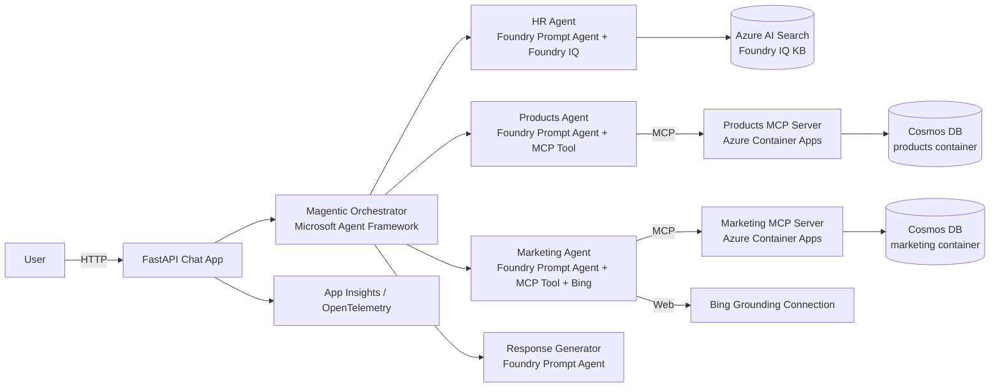

# Pepsico AI Agents Workshop (L300)

> An end-to-end, hands-on workshop where you build a **multi-agent Pepsico business assistant** using **Microsoft Foundry**, **Microsoft Agent Framework**, **Foundry IQ**, **Bing Grounding**, **Model Context Protocol (MCP)** servers on **Azure Container Apps**, and **Azure Cosmos DB**.

By the end of the workshop you will have a working chat application backed by **five specialist agents** coordinated by a **Magentic orchestrator**, all wired to real Azure services.

---

## Scenario

You are building an internal assistant for **Pepsico** employees. The assistant must answer questions across three knowledge domains and synthesize a single grounded reply:

| Domain      | Source of truth                                         | Tool surface                            |
| ----------- | ------------------------------------------------------- | --------------------------------------- |
| HR          | Pepsico HR policies (Markdown)                          | **Foundry IQ** knowledge base           |
| Products    | Pepsico product catalog in **Azure Cosmos DB**          | **Products MCP Server** (Container App) |
| Marketing   | Pepsico marketing campaigns in **Azure Cosmos DB** + live web context | **Marketing MCP Server** + **Bing Grounding** |

---

## Reference Architecture



---

## Workshop Exercises

| #  | Exercise | Outcome |
| -- | -------- | ------- |
| 00 | [Setup & Verify Pre-Provisioned Resources](docs/00_setup/00_setup.md) | Local tooling installed; `.env` configured against your Foundry, Cosmos, Search, ACA and Bing connection. |
| 01 | [Build & Deploy the Products MCP Server](docs/01_products_mcp_server/01_products_mcp_server.md) | A FastMCP server seeded from Cosmos, running locally and on Azure Container Apps. |
| 02 | [Build & Deploy the Marketing MCP Server](docs/02_marketing_mcp_server/02_marketing_mcp_server.md) | A second FastMCP server for marketing campaigns, running on Azure Container Apps. |
| 03 | [Create the HR Agent with Foundry IQ](docs/03_hr_foundry_iq_agent/03_hr_foundry_iq_agent.md) | A Foundry Prompt Agent grounded on a Foundry IQ knowledge base. |
| 04 | [Create the Products Agent (Foundry + MCP)](docs/04_products_foundry_agent/04_products_foundry_agent.md) | A Foundry Prompt Agent that calls the Products MCP server as a tool. |
| 05 | [Create the Marketing Agent (Foundry + MCP + Bing)](docs/05_marketing_foundry_agent/05_marketing_foundry_agent.md) | A Foundry Prompt Agent with Marketing MCP **and** Bing Grounding. |
| 06 | [Build the Magentic Orchestrator](docs/06_orchestrator_agent_framework/06_orchestrator_agent_framework.md) | A Microsoft Agent Framework orchestrator that routes/plans across the three specialists. |
| 07 | [Add the Response Generator Agent](docs/07_response_generator_agent/07_response_generator_agent.md) | A Foundry Prompt Agent that synthesizes the final grounded answer. |
| 08 | [Wire the Chat App & Add Observability](docs/08_chat_app_and_observability/08_chat_app_and_observability.md) | FastAPI chat UI + CLI; OpenTelemetry traces in Application Insights / Foundry. |
| 09 | [Resource Cleanup](docs/09_cleanup/09_cleanup.md) | Remove container apps, agents, KBs, connections you created. |

---

## Quick Start

> Full prerequisites are in [Exercise 00](docs/00_setup/00_setup.md). The minimum:

```powershell
# 1. Enter the repo
cd ai-agents-workshop

# 2. Create the venv and install the workshop package
python -m venv .venv
.\.venv\Scripts\Activate.ps1
python -m pip install -e ".[dev,framework,observability,mcp]"

# 3. Configure the environment
Copy-Item .env.sample .env
# Edit .env and fill in values from your pre-provisioned Azure resources

# 4. Log in to Azure (DefaultAzureCredential is used everywhere)
az login
az account set --subscription "<your-subscription-id>"

# 5. Run the chat app once you've completed at least Exercises 00-07
uvicorn src.app.main:app --reload --port 8000
```

Open <http://127.0.0.1:8000>.

---

## Repository Layout

```
ai-agents-workshop/
├── docs/                          # The workshop content (Jekyll / just-the-docs)
│   ├── 00_setup/
│   ├── 01_products_mcp_server/
│   ├── 02_marketing_mcp_server/
│   ├── 03_hr_foundry_iq_agent/
│   ├── 04_products_foundry_agent/
│   ├── 05_marketing_foundry_agent/
│   ├── 06_orchestrator_agent_framework/
│   ├── 07_response_generator_agent/
│   ├── 08_chat_app_and_observability/
│   └── 09_cleanup/
├── src/
│   ├── common/                    # Shared settings, Foundry client, observability
│   ├── mcp_servers/
│   │   ├── products/              # FastMCP server + Cosmos repo + Dockerfile + seed
│   │   └── marketing/             # FastMCP server + Cosmos repo + Dockerfile + seed
│   ├── foundry_agents/            # Scripts to create the 4 Foundry agents
│   ├── orchestrator/              # Magentic orchestrator (Microsoft Agent Framework)
│   ├── app/                       # FastAPI chat UI + CLI
│   └── knowledge_seed/hr/         # Sample HR markdown content for Foundry IQ
├── tests/                         # Smoke tests
├── .env.sample
├── pyproject.toml
└── README.md
```

---

## Pre-Provisioned Azure Resources Expected

This workshop assumes the following are **already deployed** in your subscription:

| Resource | Why it's needed |
| -------- | --------------- |
| Microsoft Foundry account + Foundry Project | Hosts the 4 prompt agents and the model deployment |
| Model deployment (e.g. `gpt-4.1-mini` or `gpt-4o`) on the Foundry project | Brain for every agent |
| Azure AI Search service | Backs the Foundry IQ knowledge base for HR |
| Azure Cosmos DB (NoSQL) account with a `pepsico` database | Backs both MCP servers |
| Azure Container Apps environment + Azure Container Registry | Hosts the two MCP servers |
| Grounding with Bing Search resource + a Foundry **connection** to it | Powers the Marketing agent's web search |
| Application Insights (optional) | Workshop observability |

Exercise 00 walks you through validating each of these.

---

## License

MIT.
