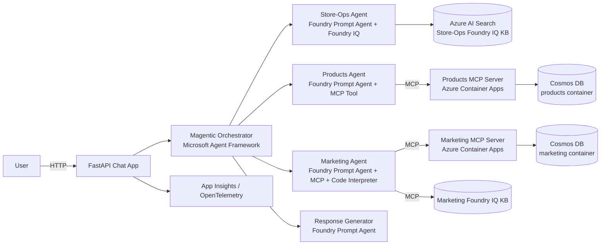

# Zava AI Agents Workshop (L300)

> An end-to-end, hands-on workshop where you build a **multi-agent assistant
> for Zava** — a fictional U.S. Pacific-Northwest DIY / home-improvement
> retailer with 7 brick-and-mortar stores plus an online fulfillment center
> — using **Microsoft Foundry**, **Microsoft Agent Framework**, **Foundry
> IQ**, **Foundry Toolbox** (web search + code-interpreter), **MCP servers**
> on **Azure Container Apps**, **Azure Cosmos DB**, and the **Foundry
> hosted-agents** runtime. The final modules layer on **quality
> evaluations**, **guardrails**, **red teaming**, and **end-to-end
> observability**.

You start with a runnable FastAPI chat UI that returns a stub response and,
exercise by exercise, replace the stub with real specialist agents —
testing in the browser as you go — until you have a Magentic orchestrator
coordinating four Foundry agents (one of them hosted on Foundry). The
three specialists share `store_id`, `category_id`, `product_id` and
`campaign_id` so the orchestrator has a real reason to plan multi-agent
paths. The last three modules add quality, safety and observability without
disturbing the working system.

The workshop is modelled on the
[Microsoft TechWorkshop L300 sample](https://github.com/microsoft/TechWorkshop-L300-AI-Apps-and-Agents)
and the
[Foundry hosted-agent demos](https://github.com/Azure-Samples/foundry-hosted-agentframework-demos).
Source files start as **scaffolds with TODOs**, every step shows the
solution behind an expandable block, and a complete reference implementation
lives under `solution/` mirroring `src/`.

---

## Scenario

You are building an internal assistant for **Zava** store teams and
marketing analysts that answers questions across three knowledge domains
and synthesises a single grounded reply. The killer demo query is:

> *“Sales for our Spring Paint Sale campaign in the Seattle store look soft
> — which SKUs are low on inventory, what does the campaign post-mortem
> from last year suggest, and what's the discount-approval policy for the
> Seattle store manager?”*

Answering it requires all three specialists, joined on `store_id=seattle`
and `campaign_id`.

| Domain      | Source of truth                                                                                       | Tool surface                                                                                                                |
| ----------- | ----------------------------------------------------------------------------------------------------- | --------------------------------------------------------------------------------------------------------------------------- |
| Store-Ops   | Per-store manager handbooks, returns, safety, HR, SOPs (Markdown, filtered by `store_id`)             | **Foundry IQ** knowledge base                                                                                               |
| Products    | Zava DIY product catalog + per-store inventory in **Azure Cosmos DB** (SKU pattern `ZV-<CAT>-NNN`)    | **Products MCP Server** (Container App)                                                                                     |
| Marketing   | Zava campaigns in Cosmos + briefs/post-mortems in Foundry IQ                                          | **Marketing MCP** + **Foundry IQ KB** + **Code Interpreter**, wired into a **Foundry Prompt Agent**                          |

---

## Reference Architecture



---

## Workshop Exercises

| #  | Exercise | Outcome |
| -- | -------- | ------- |
| 00 | [Setup & Verify Pre-Provisioned Resources](docs/00_setup/00_setup.md) | Local tooling installed; `.env` configured against your Foundry, Cosmos, Search, ACA. |
| 01 | [Scaffold the Chat App](docs/01_chat_app_scaffold/01_chat_app_scaffold.md) | Runnable FastAPI + HTML chat UI talking to a stub backend. |
| 02 | [Products MCP Server](docs/02_products_mcp_server/02_products_mcp_server.md) | FastMCP server seeded from Cosmos, running locally and on Container Apps. |
| 03 | [Products Foundry Agent + wire in](docs/03_products_foundry_agent/03_products_foundry_agent.md) | Products agent reachable from the chat UI. |
| 04 | [Marketing MCP Server](docs/04_marketing_mcp_server/04_marketing_mcp_server.md) | Second FastMCP server for marketing campaigns. |
| 05 | [Marketing Prompt Agent (Foundry IQ + Code Interpreter)](docs/05_marketing_foundry_agent/05_marketing_foundry_agent.md) | Foundry Prompt Agent wiring Marketing MCP + Foundry IQ KB + Code Interpreter. |
| 06 | [Store-Ops Foundry IQ Agent + wire in](docs/06_store_ops_foundry_iq_agent/06_store_ops_foundry_iq_agent.md) | Per-store-filtered knowledge-base-grounded agent. |
| 07 | [Magentic Orchestrator](docs/07_orchestrator_agent_framework/07_orchestrator_agent_framework.md) | Routes/plans across all three specialists using shared keys. |
| 08 | [Response Generator Agent](docs/08_response_generator/08_response_generator.md) | Final-answer synthesiser. |
| 09 | [Quality Evaluations](docs/09_evaluations/09_evaluations.md) | One-shot, scheduled, and continuous evals on the Marketing agent. |
| 10 | [Guardrails & Red Teaming](docs/10_guardrails_red_teaming/10_guardrails_red_teaming.md) | Content-filter middleware + custom policies + automated red-team scan. |
| 11 | [End-to-End Observability](docs/11_observability/11_observability.md) | OpenTelemetry → App Insights and Foundry traces for the chat app and registered agents. |
| 12 | [Resource Cleanup](docs/12_cleanup/12_cleanup.md) | Remove container apps, agent versions, KBs, eval schedules, connections you created. |

---

## Quick Start

> Full prerequisites are in [Exercise 00](docs/00_setup/00_setup.md). The minimum:

> No local Docker / container runtime is required — Container Apps deploys
> use ACR Tasks (cloud build).

```powershell
# 1. Enter the repo
cd ai-agents-workshop

# 2. Create the venv and install pinned dependencies
python -m venv .venv
.\.venv\Scripts\Activate.ps1
python -m pip install --upgrade pip
python -m pip install --pre -r requirements.txt

# 3. Configure the environment
Copy-Item .env.sample .env
# Edit .env and fill in values from your pre-provisioned Azure resources

# 4. Log in to Azure (DefaultAzureCredential is used everywhere)
az login
az account set --subscription "<your-subscription-id>"

# 5. Run the chat app right away (Exercise 01) — it will stub answers
uvicorn src.app.main:app --reload --port 8000
```

Open <http://127.0.0.1:8000>. As you finish each exercise, the new agent is
wired into the same UI so you can keep testing in the browser as you go.

---

## Repository Layout

```
ai-agents-workshop/
├── docs/                          # Workshop content (Jekyll / just-the-docs)
│   ├── 00_setup/
│   ├── 01_chat_app_scaffold/
│   ├── 02_products_mcp_server/
│   ├── 03_products_foundry_agent/
│   ├── 04_marketing_mcp_server/
│   ├── 05_marketing_foundry_agent/      # Marketing Prompt Agent (IQ + Code Interpreter)
│   ├── 06_store_ops_foundry_iq_agent/
│   ├── 07_orchestrator_agent_framework/
│   ├── 08_response_generator/
│   ├── 09_evaluations/                  # Quality + scheduled + continuous evals
│   ├── 10_guardrails_red_teaming/       # Middleware + custom policies + red team
│   ├── 11_observability/
│   └── 12_cleanup/
├── src/                           # STARTER scaffolds — fill in as you go
│   ├── common/
│   ├── mcp_servers/products/
│   ├── mcp_servers/marketing/
│   ├── foundry_agents/
│   ├── knowledge_seed/{store_ops,marketing}/
│   ├── evaluations/               # Scaffolds — see solution/evaluations/
│   ├── red_team/                  # Scaffolds — see solution/red_team/
│   └── orchestrator/
└── solution/                      # Full reference implementation
```

---

## Credits

Built on top of and inspired by:

* [Azure-Samples/foundry-hosted-agentframework-demos](https://github.com/Azure-Samples/foundry-hosted-agentframework-demos)
  — pattern for hosted agents, evaluations, guardrails, and red teaming.
* [microsoft/TechWorkshop-L300-AI-Apps-and-Agents](https://github.com/microsoft/TechWorkshop-L300-AI-Apps-and-Agents)
  — workshop format, exercise structure, and scaffold-to-solution pattern.
