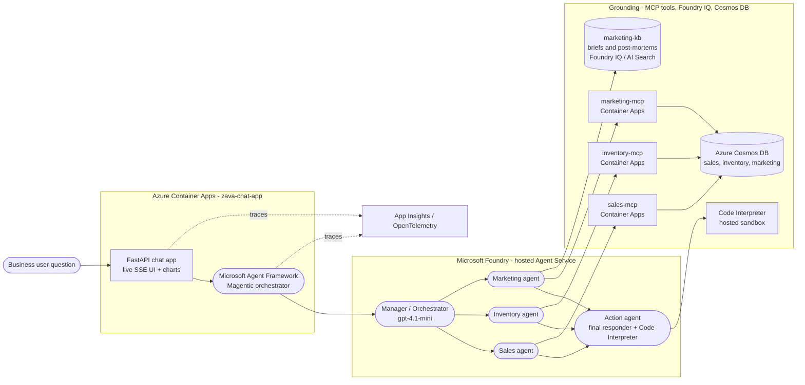

# Zava — Business Use Case, Data & Architecture

> A natural-language **“Insights-to-Action”** assistant for a retailer: a
> business user (store manager, merchandiser, marketing lead) asks a
> plain-English question; AI agents pull insights from **Sales, Inventory,
> Marketing** and an **Action agent** turns them into a short, prioritised
> list of operational actions, optionally with a chart.
>
> **Zava** is a **fictional Pacific-Northwest DIY hardware retailer** used as
> the sample dataset — brand-neutral, no references to any real company.
> Swap the seed data and the same pattern fits any retail or CPG brand.

---

## 1. The business problem

Retail decisions are **cross‑domain**. A single good decision usually needs three
facts at once:

1. **Is something selling more or less?** (Sales)
2. **Do we have stock to support it — or too much?** (Inventory)
3. **Is there a campaign behind it, and is it working?** (Marketing)

Today these live in three systems and three teams; by the time someone joins
them, the moment has passed. Zava's assistant **joins them automatically** and
recommends the move.

**Signature ("killer") scenario baked into the data — Seattle paint:**

- Sales: **paint is gently declining** month over month.
- Inventory: **Seattle is nearly out** of the top paint SKU (`ZV-PNT-001`, 3 units).
- Marketing: the **Spring Paint Sale 2026** campaign is **active** and featuring
  exactly that SKU.

→ The assistant flags "we're actively promoting a product we can't fulfil in
Seattle while the category is cooling" and recommends an **emergency
replenishment / inter-store transfer + possible promo adjustment** — something
no single dashboard would surface alone.

---

## 2. Who asks, and what they get

| Persona | Example question | What comes back |
| --- | --- | --- |
| Store manager | *“Which warehouses are low on stock and need a reorder this week?”* | A ranked replenishment list with suggested quantities. |
| Merchandiser | *“What are our top 5 products by revenue right now?”* | A ranked table + chart. |
| Marketing lead | *“How did our last Garden campaign in Seattle perform, and what did the post‑mortem say to change?”* | KPIs from live data **plus** the brief/post‑mortem learnings from the knowledge base. |
| Regional GM | *“Compare revenue across stores, where is inventory tight, and which markets should we push campaigns in — with actions.”* | A cross‑domain answer: chart + prioritised action list. |

Every answer ends with **Recommended actions** (each with an *owner*, a
*priority*, and the *evidence* it’s based on) and a `Sources:` line, so it’s
auditable.

---

## 3. Architecture

### How a question flows (left → right)

1. **User** asks a question in the browser chat UI.
2. **Container App (`zava-chat-app`)** — a FastAPI app streams events back over
   Server‑Sent Events. In the *same process* runs the **Microsoft Agent
   Framework Magentic orchestrator**.
3. **Manager agent** (hosted in Foundry, `gpt-4.1-mini`) plans the *smallest* set
   of specialist calls needed and dispatches to the specialists.
4. **Specialist agents**, each grounded by its own tools:
   - **Sales agent** → `sales-mcp` → Cosmos `sales` container.
   - **Inventory agent** → `inventory-mcp` → Cosmos `inventory` container.
   - **Marketing agent** → `marketing-mcp` → Cosmos `marketing` container **+**
     `marketing-kb` (Foundry IQ knowledge base of briefs & post‑mortems).
5. **Action agent** is always called **last**. It is the **final responder**: it
   consolidates the specialists’ insights, can use the **Code Interpreter** to
   crunch consolidated figures, writes the user‑facing reply, and emits an
   optional chart spec the UI renders client‑side with Chart.js.
6. **Observability** — the container, orchestrator and agents emit OpenTelemetry
   traces to **Application Insights**.

> The UI renders this topology live: each node lights up as its agent/tool is
> invoked, and an **Execution Trace** panel shows the manager’s plan.

### Why this shape

- **MCP servers** keep data access *outside* the model — every number is fetched
  by a typed, read-only tool, so answers are grounded and auditable.
- **Foundry IQ knowledge base** handles unstructured marketing knowledge
  (briefs, post-mortems) that doesn't fit a SQL row.
- **One terminal Action agent** produces a single, well-formatted final answer
  (no separate response hop), cutting token use and rate-limit pressure.

---

## 4. The data (three Cosmos containers + one knowledge base)

All structured data lives in **Azure Cosmos DB**. It is **synthetic but
deliberately *shaped*** so the cross‑domain story is real. Seed generators are
deterministic (fixed RNG seed) so everyone gets identical data.

### 4.1 Reference dimensions (shared vocabulary)

| Dimension | Values |
| --- | --- |
| **Stores (7 + online)** | `seattle`, `bellevue`, `tacoma`, `redmond`, `kirkland`, `spokane`, `everett`, `online` |
| **Regions** | `north`, `south`, `east`, `online` (stores roll up into regions) |
| **Categories (8)** | `paint`, `power-tools`, `hand-tools`, `garden`, `lumber`, `electrical`, `plumbing`, `hardware` |
| **Product catalog** | 8 categories × 6 products = **48 SKUs**, ids like `ZV-PNT-001` (`ZV-<CAT>-NNN`) |
| **Customer segments** | `diy`, `pro`, `contractor` (contractors buy at thinner margin) |
| **Channels** | in‑store, email, social, online, etc. |

### 4.2 Sales container — *“what is selling?”*

- **Grain:** one document per **order line**. ~**1,500 rows** across **12 rolling
  months** (ending 2026‑05).
- **Schema (per order line):**
  `id` (`ZV-SO-YYYY-NNNNNN`), `order_date`, `month` (`YYYY-MM`), `store_id`,
  `region`, `channel`, `category`, `product_id`, `product_name`,
  `customer_segment`, `units`, `unit_price_usd`, `revenue_usd`, `cost_usd`,
  `margin_usd`.
- **Trends intentionally baked in** (so `monthly_trend` shows real movement):
  - **Garden** → strong **upward** spring ramp.
  - **Paint** → gentle **decline**.
  - **Power‑tools** → mild **upward** trend.
  - **Lumber** → **mid‑window peak**.
  - **Margin** varies by segment (contractor 8% / pro 4% / diy 0% discount).

### 4.3 Inventory container — *“can we fulfil it?”*

- **Grain:** one document per **(warehouse × product × weekly snapshot)**. The
  most recent snapshot per warehouse/product is flagged `is_latest = true`;
  history powers trend tools.
- **Supply network:** four distributors / six warehouses:
  | Distributor | Region | Warehouses |
  | --- | --- | --- |
  | `DIST-NW-01` Cascade Supply Co. | north | `WH-SEA`, `WH-BEL` |
  | `DIST-SW-02` Rainier Wholesale Partners | south | `WH-TAC` |
  | `DIST-E-03` Inland Northwest Distribution | east | `WH-SPO` |
  | `DIST-ON-04` Zava Direct Fulfilment | online | `WH-DC1`, `WH-DC2` |
- **Key fields/metrics:** `stock_status` (`healthy` / `low` / `overstock` /
  `stockout`), available units, `reorder_threshold`/reorder point, `max_stock`,
  weekly demand, and **`weeks_of_cover` = available_units ÷ weekly_demand_units`.
- **Outliers seeded for the demo:** **Seattle paint** is critically low
  (`ZV-PNT-001` = 3 units), plus a low **Spokane** power‑tool and a low
  **Everett** lumber SKU.

### 4.4 Marketing container — *“are we promoting it, and is it working?”*

- **Grain:** one document per **campaign**. Mix of statuses:
  - **`active`** (5) — e.g. *Spring Paint Sale 2026*, *Pro Power‑Tool Days*,
    *Garden Kickoff Weekend*, *Deck‑Building Workshop Series*, *Smart Home
    Lighting Bundle*.
  - **`planned`** (3) — future campaigns with no spend yet.
  - **`post-mortem`** (4) — last year’s results **with ROI**, e.g. *Spring Paint
    Sale 2025* (ROI 1.42), *Pro Power‑Tool Days 2025* (ROI 2.18).
- **KPIs per campaign:** `category`, dates, `stores`, `featured_products`,
  `discount_percent`, `channel`, `target_audience`, `budget_usd`, `spend_usd`,
  `impressions`, `clicks`, `roi`, and a link to a `kb_brief`.

### 4.5 Marketing knowledge base (Foundry IQ) — *the “why”*

Unstructured campaign **briefs** and **post‑mortems** (e.g.
`post_mortem_2025_spring_paint.md`) indexed into a Foundry IQ knowledge base
(Azure AI Search). This is what lets the marketing agent answer *“what did the
post‑mortem say we should change next time?”* — qualitative learnings that don’t
exist as a number in Cosmos.

---

## 5. What insights each agent draws

### Sales agent (`sales-mcp` tools)

| Tool | Insight it produces |
| --- | --- |
| `list_dimensions` | Valid stores / regions / categories / months to filter on. |
| `revenue_summary` | Totals (revenue, units, margin, orders) grouped by any dimension. |
| `monthly_trend` | Revenue/units/margin per month → **spot rises & falls**. |
| `top_products` | Best — or worst (`ascending=true`) — products = markdown candidates. |
| `sales_for_product` | One product’s totals + per‑region split. |
| `get_order` | A single order line by id. |

### Inventory agent (`inventory-mcp` tools)

| Tool | Insight it produces |
| --- | --- |
| `list_distributors` | Distributors, their warehouses & regions. |
| `stock_status_summary` | Counts of SKUs by status (healthy/low/overstock/stockout). |
| `low_stock` | SKUs at/below reorder point = **replenishment candidates**. |
| `overstock` | SKUs above max = **markdown/transfer candidates**. |
| `reorder_recommendations` | Low SKUs + suggested reorder qty & lead time. |
| `inventory_for_product` | Latest cross‑warehouse position for a product. |
| `inventory_trend` | Weekly weeks‑of‑cover history. |

### Marketing agent (`marketing-mcp` tools + `marketing-kb`)

| Tool | Insight it produces |
| --- | --- |
| `list_active_campaigns` | What’s live right now. |
| `list_campaigns_by_category` / `by_store` | Campaigns touching a category/market. |
| `get_campaign` | Full campaign detail. |
| `search_campaigns` | Free‑text find. |
| `campaign_performance` | KPI rollup (spend, impressions, clicks, ROI). |
| **`marketing-kb`** (Foundry IQ) | Qualitative brief / post‑mortem learnings. |

### Action agent (the consolidation)

Takes the three insight streams and produces:

- a one‑line direct answer,
- a **`## Recommended actions`** numbered list — each item has **action**,
  *Owner* (Merchandising / Distributor Ops / Marketing / Store Manager),
  *Priority* (High/Medium/Low), and *Why* (the cited evidence),
- an optional **`## Snapshot`** chart (bar/line/pie) built only from real
  numbers (Code Interpreter may consolidate them), and
- a **`Sources:`** line.

---

## 6. The five default demo questions → what they exercise

| # | Question | Domains / data exercised |
| --- | --- | --- |
| 1 | *How did our last Garden campaign in Seattle perform, and what did the post‑mortem say to change?* | **Marketing MCP** (KPIs) **+ Foundry IQ KB** (post‑mortem). |
| 2 | *What are our top 5 products by revenue right now?* | **Sales** only (`top_products`) — simple, chart‑worthy. |
| 3 | *Which warehouses are low on stock and need a reorder this week?* | **Inventory** only (`low_stock` / `reorder_recommendations`). |
| 4 | *Compare revenue across stores, where is inventory tight, which markets to push campaigns — with actions.* | **All three** + chart + action list. |
| 5 | *Garden sales are trending up — do we have enough stock and an active campaign to support it?* | **Sales** (garden uptrend) + **Inventory** (cover) + **Marketing** (Garden Kickoff) → action. |

---

## 7. ID & convention cheat‑sheet

| Pattern | Meaning | Example |
| --- | --- | --- |
| `ZV-<CAT>-NNN` | Product / SKU | `ZV-PNT-001` (Premium Interior Paint) |
| `ZV-SO-YYYY-NNNNNN` | Sales order line | `ZV-SO-2026-000001` |
| `ZV-CMP-YYYY-NNN` | Marketing campaign | `ZV-CMP-2026-001` (Spring Paint Sale) |
| `DIST-XX-NN` | Distributor | `DIST-NW-01` (Cascade Supply Co.) |
| `WH-XXX` | Warehouse | `WH-SEA` (Seattle) |
| Money | USD | `revenue_usd`, `budget_usd` |
| Month | `YYYY-MM` | `2026-05` |
| `weeks_of_cover` | available_units ÷ weekly_demand_units | stock runway |

---

## 8. One‑line summary

> **Zava turns three streams of retail data — Sales (what’s selling), Inventory
> (can we fulfil it), and Marketing (are we promoting it) — into one grounded,
> prioritised set of actions, automatically, in response to a plain‑English
> question.**
