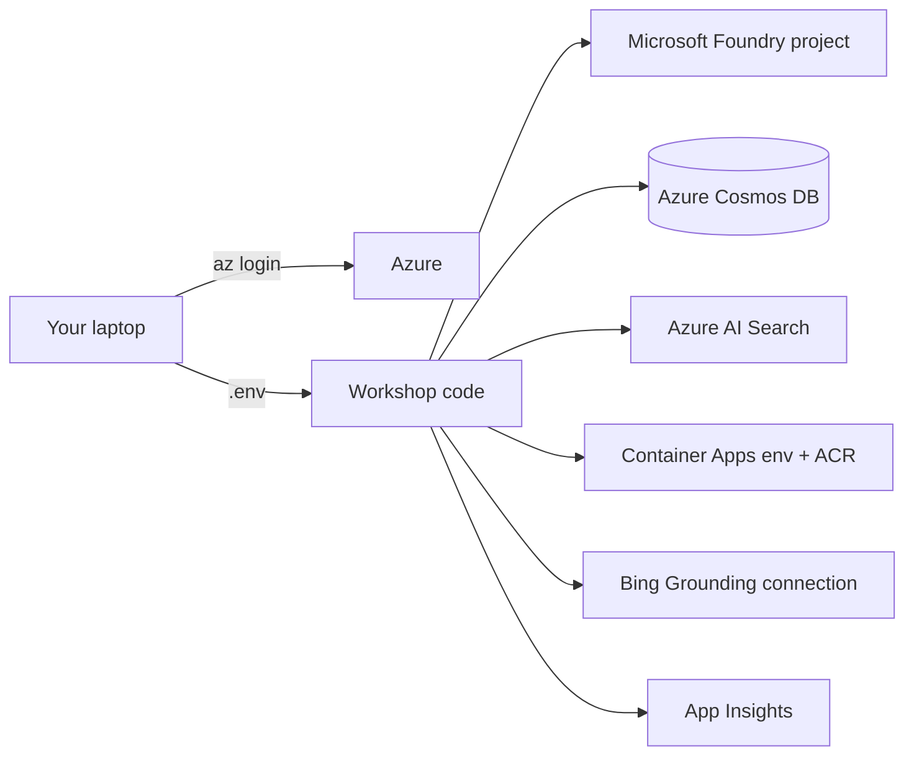

# Exercise 00 — Setup & Verify Pre-Provisioned Azure Resources

In this exercise you will install the local tooling, clone the workshop, and
verify that you can reach every **pre-provisioned** Azure resource the rest of
the workshop depends on. You will *not* deploy any new infrastructure here —
the resources are assumed to already exist in your subscription.

## Scenario

Your platform team has provisioned a shared Azure environment for the workshop.
Before you can start building agents you need to:

1. Install the local tools (Python, Azure CLI, Docker, VS Code).
2. Clone the workshop repo and create a Python virtual environment.
3. Sign in to Azure and confirm role assignments.
4. Inventory the pre-provisioned resources and write their identifiers into a
   local `.env` file that every subsequent exercise will read from.

## Success criteria

{: .success }
> By the end of this exercise:
> - `python --version` returns 3.11 or higher.
> - `az account show` returns the workshop subscription.
> - You have a populated `.env` file at the repo root.
> - `python -m src.common.settings` runs without errors.
> - `pytest tests/test_smoke.py -q` passes.
> - You can list your Foundry project, your Cosmos DB account, your Azure AI
>   Search service, your Container Apps environment, and your Bing Grounding
>   connection from the CLI.

## Tasks

| Task | Description |
| ---- | ----------- |
| [00.01 — Local prerequisites](00_01_prerequisites.md) | Install Python, Azure CLI, Docker, VS Code, Git. |
| [00.02 — Clone and bootstrap the repo](00_02_clone_and_bootstrap.md) | Clone, create venv, install the workshop package, copy `.env`. |
| [00.03 — Verify pre-provisioned resources](00_03_verify_resources.md) | Find every resource id and populate `.env`. |
| [00.04 — Verify your environment](00_04_verify_environment.md) | Run the smoke tests and a Cosmos / Foundry connectivity check. |

## Architecture you are wiring up

## Optional: Publish the workshop on GitHub Pages

This repo is preconfigured with Jekyll + `just-the-docs`, just like the
[TechWorkshop sample](https://github.com/microsoft/TechWorkshop-L300-AI-Apps-and-Agents).

1. Push the repo to GitHub.
2. **Settings → Pages → Build and deployment → Source: GitHub Actions**.
3. Update `_config.yml` with your `url:` and `aux_links` GitHub URL.
4. The included `.github/workflows/jekyll-gh-pages.yml` workflow will build and
   publish the site automatically on every push to `main`.
