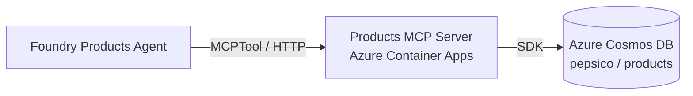

# Exercise 01 — Build & Deploy the Pepsico Products MCP Server

In this exercise you build the **first** of the two MCP servers your Foundry
agents will use. The server exposes the Pepsico product catalog stored in
Azure Cosmos DB through four Model Context Protocol tools.

## Scenario

The Products agent (Exercise 04) needs typed, structured access to the Pepsico
product catalog. MCP gives any compliant LLM client (including Foundry's
`MCPTool`) a strongly-typed JSON-RPC interface to a remote tool server. We
will:

1. Seed the Cosmos DB `products` container with 12 sample Pepsico SKUs.
2. Build a **FastMCP** server in Python that surfaces four tools on top of
   Cosmos DB.
3. Run the server locally and exercise it with the MCP inspector.
4. Containerise the server and deploy it to **Azure Container Apps**.
5. Record the public URL of the running server in `.env` so Exercise 04 can
   register it as a Foundry connection.

## Architecture

## Success criteria

{: .success }
> By the end of this exercise:
> - The Cosmos `pepsico` database exists with a `products` container holding
>   12 documents.
> - `pepsico-products-mcp` runs locally on <http://127.0.0.1:8001/mcp> and the
>   MCP inspector lists the four tools.
> - A Container App named `pepsico-products-mcp` is running in your ACA
>   environment with a public ingress URL.
> - `PRODUCTS_MCP_URL=<...>/mcp` is set in `.env`.
> - `curl <url>/mcp` returns a 405 (the server is reachable; GET is rejected
>   by design — MCP uses POST).

## Tasks

| Task | Description |
| ---- | ----------- |
| [01.01 — Seed Cosmos DB with product data](01_01_seed_cosmos.md) | Create the `products` container and upsert 12 documents. |
| [01.02 — Walk through the MCP server code](01_02_build_mcp_server.md) | Inspect `server.py`, `cosmos_repo.py`, and the FastMCP tool decorators. |
| [01.03 — Run the server locally](01_03_run_locally.md) | Start the server and test it with the MCP inspector. |
| [01.04 — Deploy to Azure Container Apps](01_04_deploy_container_app.md) | Build the image, push to ACR, run `az containerapp up`. |
