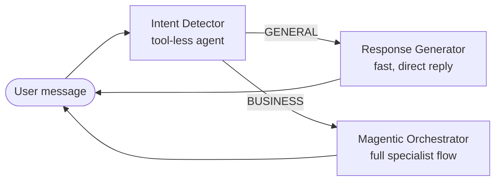

# Exercise 02 — Build Your First Agent: the Intent Detector

## Scenario

Not every message needs the full multi-agent flow. A greeting like *"hi"* or
*"what can you do?"* should get a fast, friendly reply — not a sales,
inventory, and marketing investigation. The **Intent Detector** is a tiny,
**tool-less** agent that classifies the latest message as `GENERAL` or
`BUSINESS` with a single word.

The orchestrator (Module 5) uses that verdict to decide whether to answer
directly via the Response Generator or run the full Magentic flow — a simple,
effective control on cost and latency.

## How it fits together



## What you will build

A tool-less Foundry Prompt Agent `zava-intent-detector` that replies with
exactly `GENERAL` or `BUSINESS`.

## Steps

### Option 1 — Portal

1. Go to the [Foundry portal](https://ai.azure.com), open your workshop project, and choose **Build** → **Agents**.
2. Select **Create agent**.
3. In **Setup**, use these values:

    | Field | Value |
    | ----- | ----- |
    | Agent name | `zava-intent-detector` |
    | Model deployment | Your `AZURE_AI_MODEL_DEPLOYMENT` value, usually `gpt-4.1-mini` |
    | Instructions | Paste the `system:` body from `src/prompts/intent_agent.prompty` |

4. Leave **Tools** empty. This agent is intentionally tool-less.
5. Save or create the agent, then open **Try in playground**.

### Option 2 — Script

```powershell
python -m src.foundry_agents.create_intent_agent
```

Code:
[src/foundry_agents/create_intent_agent.py](https://github.com/SinglaSandeep/ai-agents-workshop/blob/main/src/foundry_agents/create_intent_agent.py).

{: .note }
> **Verify it worked:** confirm `zava-intent-detector` appears in the
> [Foundry portal](https://ai.azure.com) under **Agents**.

## Success criteria

- `zava-intent-detector` exists in your Foundry project.
- It returns a single word — `GENERAL` or `BUSINESS` — with no punctuation.

## Test it in the Foundry playground

Now chat with the agent you just created. The quickest way to try a single
agent is the **Agents playground** in the Foundry portal. This is a tiny,
tool-less agent — a great first one to understand how instructions alone shape
behaviour. (The local chat app is the frontend for the **multi-agent**
assistant in Module 5.)

### Open the playground

1. Go to the [Foundry portal](https://ai.azure.com) and sign in with the same
   account you used for `az login`.
2. In the left menu choose **Agents** (under *Build and customize*), then make
   sure the project selector at the top shows **your** workshop project.
3. Click the **`zava-intent-detector`** row to open it, then select **Try in
   playground** (the chat pane on the right).

### Chat with the agent

Send a few different messages and watch the one-word reply:

| Try this prompt | Expected reply |
| --------------- | -------------- |
| *"hi there"* | `GENERAL` |
| *"thanks!"* | `GENERAL` |
| *"how are garden sales trending?"* | `BUSINESS` |
| *"are we overstocked anywhere?"* | `BUSINESS` |

### What to look for (beginner checklist)

- The reply is exactly **one word** — `GENERAL` or `BUSINESS` — with no extra
  text or punctuation.
- There are **no tool calls** in the run steps: this agent classifies using its
  **instructions** only.
- Try editing the prompt phrasing to see how robust the classification is — a
  good way to learn how instructions drive an agent.

{: .note }
> **New to the playground?** See Microsoft Learn:
> [What is Foundry Agent Service?](https://learn.microsoft.com/azure/foundry/agents/overview) ·
> [Get started with Foundry agents](https://learn.microsoft.com/azure/foundry/quickstarts/get-started-code)
