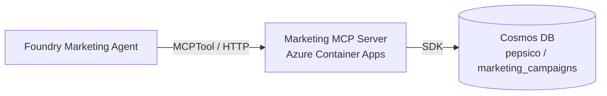

# Exercise 02 — Build & Deploy the Pepsico Marketing MCP Server

In this exercise you build the **second** MCP server. It surfaces the Pepsico
marketing campaigns container in Cosmos DB through five tools, and you deploy
it as a second Container App.

The structure is identical to Exercise 01 — this is intentional. You will
see how easily the same pattern composes for a new domain.

## Scenario

The Marketing agent (Exercise 05) will combine **internal** campaign data
(this MCP server) with **live web context** (Bing Grounding). You need a
stable, typed surface for the internal data first.

## Architecture

## Tools exposed

| Tool | Purpose |
| ---- | ------- |
| `list_active_campaigns(limit)` | "What's running right now?" |
| `list_campaigns_by_brand(brand, limit)` | "Show me all Gatorade activity." |
| `get_campaign(campaign_id)` | Detail look-up after a previous answer |
| `search_campaigns(text, limit)` | Free-text natural-language queries |
| `campaign_performance(campaign_id)` | KPIs: impressions, CTR, conversions, ROI |

## Success criteria

{: .success }
> By the end of this exercise:
> - The Cosmos `pepsico` database has a `marketing_campaigns` container with
>   8 sample campaign documents.
> - `pepsico-marketing-mcp` runs locally on <http://127.0.0.1:8002/mcp>.
> - A Container App named `pepsico-marketing-mcp` is `Running` in your ACA
>   environment.
> - `MARKETING_MCP_URL=<...>/mcp` is set in `.env`.

## Tasks

| Task | Description |
| ---- | ----------- |
| [02.01 — Seed Cosmos DB with campaign data](02_01_seed_cosmos.md) | Create the container and upsert 8 documents. |
| [02.02 — Walk through the MCP server code](02_02_build_mcp_server.md) | Spot the differences from Exercise 01. |
| [02.03 — Run locally and deploy to ACA](02_03_deploy_container_app.md) | Same flow as Exercise 01, parameterised for marketing. |
