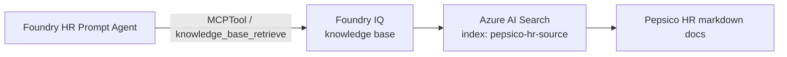

# Exercise 03 — Create the HR Agent with Foundry IQ

In this exercise you build your **first Foundry agent**: a Foundry **Prompt
Agent** whose only tool is a **Foundry IQ knowledge base** built over Pepsico
HR policy documents in Azure AI Search.

## What is Foundry IQ?

[Foundry IQ](https://learn.microsoft.com/azure/foundry/agents/how-to/foundry-iq-connect)
turns an Azure AI Search service into a **managed retrieval surface** that any
Foundry agent can query through the MCP protocol. You give it one or more
*knowledge sources* (a search index, a SharePoint site, etc.), and Foundry IQ
exposes a `knowledge_base_retrieve` MCP tool that does agentic retrieval
(query rewriting, re-ranking, answer synthesis with citations).

## Architecture

## Success criteria

{: .success }
> By the end of this exercise:
> - An Azure AI Search index named `pepsico-hr-source` contains the four HR
>   markdown files from `src/knowledge_seed/hr/`.
> - A Foundry IQ knowledge base named `pepsico-hr-kb` exists.
> - A Foundry project connection named `pepsico-hr-kb-conn` reaches the KB's
>   MCP endpoint via the project's managed identity.
> - A Foundry agent named `pepsico-hr-agent` exists and can answer
>   "*What is the PTO carryover policy?*" with content from the seed docs and
>   a `Sources:` line citing `pepsico_pto_policy.md`.

## Tasks

| Task | Description |
| ---- | ----------- |
| [03.01 — Provision the knowledge base](03_01_create_knowledge_base.md) | Run `setup_hr_knowledge_base.py`: build the index, upload docs, create the KB, register the project connection. |
| [03.02 — Create the HR Foundry agent](03_02_create_hr_agent.md) | Run `create_hr_agent.py` to attach the KB as an MCP tool to a Prompt Agent. |
| [03.03 — Test the agent in Foundry portal and CLI](03_03_test_agent.md) | Verify with a representative question. |
