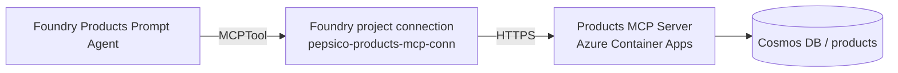

# Exercise 04 — Create the Products Agent (Foundry Prompt Agent + MCP Tool)

You will create the **Products specialist agent**: a Foundry **Prompt Agent**
that uses the Products MCP server from Exercise 01 as its only tool.

## Architecture

## Two pieces of plumbing

1. A **Foundry project connection** of type `RemoteTool` pointing at the
   Container App URL. This is what authenticates the call (via the project's
   managed identity).
2. An **`MCPTool`** on the agent definition that references that connection
   by name.

The single script `create_products_agent.py` does both.

## Success criteria

{: .success }
> By the end of this exercise:
> - A Foundry connection named `pepsico-products-mcp-conn` exists with
>   target `PRODUCTS_MCP_URL`.
> - A Foundry agent named `pepsico-products-agent` exists with the MCP tool
>   attached.
> - In the Foundry portal Playground the agent answers
>   "*List all our beverage products under 200 calories*" by calling
>   `list_products` and `search_products`, citing the SKU ids.

## Tasks

| Task | Description |
| ---- | ----------- |
| [04.01 — Register the MCP connection](04_01_register_mcp_connection.md) | Run a one-liner to upsert the project connection (the script also does this for you). |
| [04.02 — Create the Products Foundry agent](04_02_create_products_agent.md) | Run `create_products_agent.py`. |
| [04.03 — Test the agent](04_03_test_agent.md) | Validate with three representative questions. |
