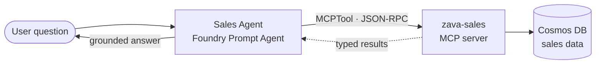

# Exercise 04 — Build the Sales Agent (wired to the Sales MCP Tool)

## Scenario

The Sales agent answers questions like *"Which categories are trending this
quarter?"* It does **not** make up numbers — it reads them from a typed
**MCP server** backed by Azure Cosmos DB. **Model Context Protocol (MCP)**
gives Foundry's `MCPTool` a strongly-typed JSON-RPC interface to a remote
tool server.

## What you will build

- A **Sales Foundry Prompt Agent** (`zava-sales-agent`) wired to the
  `zava-sales` MCP server you built in Module 2.

## How it fits together



## MCP tools exposed

`list_dimensions` · `revenue_summary` · `monthly_trend` · `top_products` ·
`sales_for_product` · `get_order`

## Steps

### 1. Make sure the Sales MCP tool is reachable

You built, ran, and (optionally) deployed the **Sales MCP server** in
[Module 2 — Build the MCP Tools](../03_mcp_tools/03_mcp_tools.md). The Foundry
agent reaches it through `SALES_MCP_URL` in your `.env`. For portal-created
agents, use the deployed Container Apps endpoint because Foundry needs a remote
MCP endpoint. For local MCP testing, keep the server running locally:

```powershell
uvicorn src.mcp_servers.sales.server:app --port 8001
```

…or point `SALES_MCP_URL` at the Container App you deployed in Module 2.

> The `sales` data is **already pre-loaded by your platform team**. If you need
> to seed your own environment, the command is idempotent:
> `python -m src.mcp_servers.sales.seed.seed_cosmos`.

### 2. Create the Sales Foundry agent

#### Option 1 — Portal

First create the tool, then attach it to the agent.

1. In the [Foundry portal](https://ai.azure.com), open your workshop project.
2. Choose **Build** → **Tools** → **Add tool**.
3. Select **Model Context Protocol (MCP)** or **Custom MCP server**.
4. Configure the tool:

   | Field | Value |
   | ----- | ----- |
   | Name | `zava-sales` |
   | Remote MCP server endpoint | Your `SALES_MCP_URL`, for example `https://<sales-container-app>/mcp` |
   | Authentication | `Key-based` |
   | Credential | Key `Authorization`, Value `Basic <base64 of MCP_BASIC_AUTH_USERNAME:MCP_BASIC_AUTH_PASSWORD>` (see `.env`) |
   | Approval | `Never` |

5. Save the tool and confirm it lists the Sales tools:
   `list_dimensions`, `revenue_summary`, `monthly_trend`, `top_products`,
   `sales_for_product`, `get_order`.
6. Choose **Build** → **Agents** → **Create agent**.
7. In **Setup**, use these values:

   | Field | Value |
   | ----- | ----- |
   | Agent name | `zava-sales-agent` |
   | Model deployment | Your `AZURE_AI_MODEL_DEPLOYMENT` value, usually `gpt-4.1-mini` |
   | Instructions | Paste the `system:` body from `src/prompts/sales_agent.prompty` |

8. In **Tools**, select **Add**, choose the `zava-sales` MCP tool you just
   created, and add it to the agent.
9. Save or create the agent, then open **Try in playground**.

#### Option 2 — Script

```powershell
python -m src.foundry_agents.create_sales_agent
```

This registers the `zava-sales` MCP project connection and creates/updates the
`zava-sales-agent` Foundry Prompt Agent. The agent code lives in
[src/foundry_agents/create_sales_agent.py](https://github.com/SinglaSandeep/ai-agents-workshop/blob/main/src/foundry_agents/create_sales_agent.py).

{: .note }
> **Verify it worked:** the script prints the agent name on success. You can
> also open the [Foundry portal](https://ai.azure.com) → **Agents** and confirm
> `zava-sales-agent` is listed.

## Success criteria

- The Sales MCP server starts and lists its six tools.
- `zava-sales-agent` exists in your Foundry project.
- The agent returns sales insights grounded in Cosmos data (no invented figures).

## Test it in the Foundry playground

You just created your first agent — now let's chat with it. The quickest way to
try a single agent is the **Agents playground** in the Foundry portal. (The
local chat app is the frontend for the **multi-agent** assistant in Module 5,
not for individual agents.)

### Open the playground

1. Go to the [Foundry portal](https://ai.azure.com) and sign in with the same
   account you used for `az login`.
2. In the left menu choose **Agents** (under *Build and customize*), then make
   sure the project selector at the top shows **your** workshop project.
3. Click the **`zava-sales-agent`** row to open it, then select **Try in
   playground** (the chat pane on the right).

### Chat with the agent

Type a question and press **Enter**. Start simple, then go deeper:

| Try this prompt | What a good answer looks like |
| --------------- | ----------------------------- |
| *"What can you help me with?"* | A short description of its sales role |
| *"Which categories grew the most last month?"* | Named categories with **real** numbers from Cosmos |
| *"Show revenue by region for power-tools."* | A regional breakdown, no invented figures |

### What to look for (beginner checklist)

- The reply uses **actual data** (specific figures/IDs), not made-up numbers.
- Expand the message's **tool calls / run steps** to see the Sales MCP tools
  (e.g. `revenue_summary`, `top_products`) being invoked — proof the agent is
  reading Cosmos, not guessing.
- Ask a follow-up (*"and the month before?"*) to see it keep context in the thread.

{: .note }
> **New to the playground?** See Microsoft Learn:
> [What is Foundry Agent Service?](https://learn.microsoft.com/azure/foundry/agents/overview) ·
> [Get started with Foundry agents](https://learn.microsoft.com/azure/foundry/quickstarts/get-started-code) ·
> [Use the Model Context Protocol (MCP) tool](https://learn.microsoft.com/azure/foundry/agents/how-to/tools/model-context-protocol)
