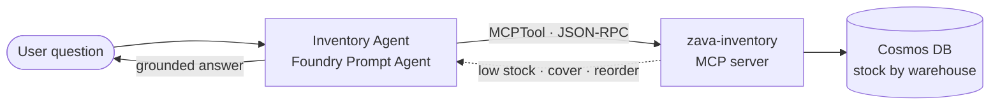

# Exercise 05 — Build the Inventory Agent (wired to the Inventory MCP Tool)

## Scenario

The Inventory agent surfaces stock-health insights across Zava's four
distributors and six warehouses — low stock, overstock, weeks of cover, and
reorder needs. Like the Sales agent, it reads only typed values from an MCP
server backed by Cosmos DB.

## Distributors → warehouses

`DIST-NW-01` Cascade (north) → WH-SEA, WH-BEL · `DIST-SW-02` Rainier (south)
→ WH-TAC · `DIST-E-03` Inland NW (east) → WH-SPO · `DIST-ON-04` Zava Direct
(online) → WH-DC1, WH-DC2.

## How it fits together



## MCP tools exposed

`list_distributors` · `stock_status_summary` · `low_stock` · `overstock` ·
`reorder_recommendations` · `inventory_for_product` · `inventory_trend` ·
`get_inventory`

## Steps

### 1. Make sure the Inventory MCP tool is reachable

You built and tested the **Inventory MCP server** in
[Module 2 — Build the MCP Tools](../03_mcp_tools/03_mcp_tools.md). The Foundry
agent reaches it through `INVENTORY_MCP_URL` in your `.env`. For portal-created
agents, use the deployed Container Apps endpoint because Foundry needs a remote
MCP endpoint. For local MCP testing, keep the server running locally:

```powershell
uvicorn src.mcp_servers.inventory.server:app --port 8002
```

…or point `INVENTORY_MCP_URL` at the Container App you deployed in Module 2.

> The `inventory` data is **already pre-loaded by your platform team**. If you
> need to seed your own environment, the command is idempotent:
> `python -m src.mcp_servers.inventory.seed.seed_cosmos`.

### 2. Create the Inventory Foundry agent

#### Option 1 — Portal

First create the tool, then attach it to the agent.

1. In the [Foundry portal](https://ai.azure.com), open your workshop project.
2. Choose **Build** → **Tools** → **Add tool**.
3. Select **Model Context Protocol (MCP)** or **Custom MCP server**.
4. Configure the tool:

   | Field | Value |
   | ----- | ----- |
   | Name | `zava-inventory` |
   | Remote MCP server endpoint | Your `INVENTORY_MCP_URL`, for example `https://<inventory-container-app>/mcp` |
   | Authentication | `Key-based` |
   | Credential | Key `Authorization`, Value `Basic <base64 of MCP_BASIC_AUTH_USERNAME:MCP_BASIC_AUTH_PASSWORD>` (see `.env`) |
   | Approval | `Never` |

5. Save the tool and confirm it lists the Inventory tools:
   `list_distributors`, `stock_status_summary`, `low_stock`, `overstock`,
   `reorder_recommendations`, `inventory_for_product`, `inventory_trend`,
   `get_inventory`.
6. Choose **Build** → **Agents** → **Create agent**.
7. In **Setup**, use these values:

   | Field | Value |
   | ----- | ----- |
   | Agent name | `zava-inventory-agent` |
   | Model deployment | Your `AZURE_AI_MODEL_DEPLOYMENT` value, usually `gpt-4.1-mini` |
   | Instructions | Paste the `system:` body from `src/prompts/inventory_agent.prompty` |

8. In **Tools**, select **Add**, choose the `zava-inventory` MCP tool you just
   created, and add it to the agent.
9. Save or create the agent, then open **Try in playground**.

#### Option 2 — Script

```powershell
python -m src.foundry_agents.create_inventory_agent
```

Creates the `zava-inventory-mcp-conn` MCP connection and the
`zava-inventory-agent` Foundry Prompt Agent. Code:
[src/foundry_agents/create_inventory_agent.py](https://github.com/SinglaSandeep/ai-agents-workshop/blob/main/src/foundry_agents/create_inventory_agent.py).

{: .note }
> **Verify it worked:** confirm `zava-inventory-agent` appears in the
> [Foundry portal](https://ai.azure.com) under **Agents**.

## Success criteria

- The Inventory MCP server starts and lists its eight tools.
- `zava-inventory-agent` exists in your Foundry project.
- The agent reports `weeks_of_cover` plus the warehouse/distributor for each insight.

## Test it in the Foundry playground

Now chat with the agent you just created. The quickest way to try a single
agent is the **Agents playground** in the Foundry portal. (The local chat app
is the frontend for the **multi-agent** assistant in Module 5, not for
individual agents.)

### Open the playground

1. Go to the [Foundry portal](https://ai.azure.com) and sign in with the same
   account you used for `az login`.
2. In the left menu choose **Agents** (under *Build and customize*), then make
   sure the project selector at the top shows **your** workshop project.
3. Click the **`zava-inventory-agent`** row to open it, then select **Try in
   playground** (the chat pane on the right).

### Chat with the agent

Type a question and press **Enter**. Start simple, then go deeper:

| Try this prompt | What a good answer looks like |
| --------------- | ----------------------------- |
| *"What can you help me with?"* | A short description of its inventory role |
| *"Which products are below reorder point this week?"* | A list with `weeks_of_cover` and the warehouse/distributor |
| *"Where are we overstocked on garden items?"* | Specific warehouses/distributors, real numbers |

### What to look for (beginner checklist)

- Each insight names a **warehouse/distributor** and a `weeks_of_cover` value.
- Expand the message's **tool calls / run steps** to see the Inventory MCP
  tools (e.g. `low_stock`, `reorder_recommendations`) being invoked — proof the
  agent is reading Cosmos, not guessing.
- Ask a follow-up (*"which of those is most urgent?"*) to see it keep context.

{: .note }
> **New to the playground?** See Microsoft Learn:
> [What is Foundry Agent Service?](https://learn.microsoft.com/azure/foundry/agents/overview) ·
> [Get started with Foundry agents](https://learn.microsoft.com/azure/foundry/quickstarts/get-started-code) ·
> [Use the Model Context Protocol (MCP) tool](https://learn.microsoft.com/azure/foundry/agents/how-to/tools/model-context-protocol)
