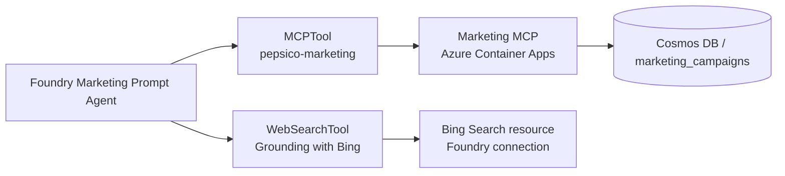

# Exercise 05 — Create the Marketing Agent (Foundry + MCP + Bing Grounding)

This exercise builds the most interesting specialist: a Foundry Prompt Agent
with **two** tools.

1. The **Marketing MCP server** from Exercise 02 — the source of truth for
   internal Pepsico campaign data.
2. The **Grounding with Bing Search** tool — for live web context (news,
   competitor announcements, public trends).

The agent's instructions teach it which tool to pick for which class of
question.

## Architecture

## Success criteria

{: .success }
> By the end of this exercise:
> - A Foundry connection named `pepsico-marketing-mcp-conn` exists.
> - A **Grounding-with-Bing-Search** Foundry connection exists on the project
>   (or you create it).
> - A Foundry agent named `pepsico-marketing-agent` exists with both tools attached.
> - The agent answers "*Which Gatorade campaigns target youth athletes?*" using
>   the MCP server.
> - The agent answers "*What's the latest news about Doritos Super Bowl ads?*"
>   using the Bing tool, with URL citations.

## Tasks

| Task | Description |
| ---- | ----------- |
| [05.01 — Register MCP & Bing connections](05_01_register_mcp_and_bing.md) | Confirm or create both Foundry connections. |
| [05.02 — Create the Marketing Foundry agent](05_02_create_marketing_agent.md) | Run `create_marketing_agent.py`. |
| [05.03 — Test the agent (internal + web)](05_03_test_agent.md) | Validate routing between MCP and Bing. |
