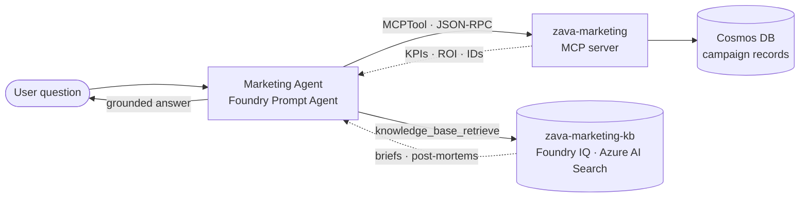

# Exercise 06 — Build the Marketing Agent (MCP tool + Foundry IQ knowledge)

## Scenario

The Marketing agent answers campaign questions (status, budget, channels,
KPIs, ROI). It uses **two** sources:

1. **`zava-marketing` MCP server** — structured campaign records from Cosmos
   (the source of truth for facts and IDs).
2. **`zava-marketing-kb` Foundry IQ knowledge base** — unstructured briefs and
   post-mortems indexed into Azure AI Search and retrieved via the managed
   `knowledge_base_retrieve` tool.

This is the exercise where **MCP (tools) and Foundry IQ (knowledge)** come
together in a single agent.

## How it fits together



The MCP server is the source of truth for **facts and IDs**; the Foundry IQ
knowledge base adds **unstructured context** (briefs, post-mortems).

## MCP tools exposed

`list_active_campaigns` · `list_campaigns_by_category` ·
`list_campaigns_by_store` · `get_campaign` · `search_campaigns` ·
`campaign_performance`

## Steps

### 1. Make sure the Marketing MCP tool is reachable

You built the **Marketing MCP server** in
[Module 2 — Build the MCP Tools](../03_mcp_tools/03_mcp_tools.md). The Foundry
agent reaches it through `MARKETING_MCP_URL` in your `.env`. Keep it running
locally:

```powershell
uvicorn src.mcp_servers.marketing.server:app --port 8003
```

…or point `MARKETING_MCP_URL` at the Container App you deployed in Module 2.

> The `marketing` data is **already pre-loaded by your platform team**. To seed
> your own environment (idempotent):
> `python -m src.mcp_servers.marketing.seed.seed_cosmos`.

### 2. (Optional) Build the Marketing Foundry IQ knowledge base

This is the **new** ingredient in this module — the **knowledge** layer. The
`zava-marketing-kb` knowledge base is **already built by your platform team**.
Run this only if you are building your own:

```powershell
python -m src.foundry_agents.setup_marketing_knowledge_base
```

This creates the Azure AI Search index, uploads the briefs/post-mortems from
`src/knowledge_seed/marketing/`, creates the `zava-marketing-kb` knowledge
base, and registers its project connection.

### 3. Create the Marketing Foundry agent

```powershell
python -m src.foundry_agents.create_marketing_agent
```

Wires the Marketing MCP server **and** the Foundry IQ KB into the
`zava-marketing-agent` Prompt Agent. Code:
[src/foundry_agents/create_marketing_agent.py](https://github.com/SinglaSandeep/ai-agents-workshop/blob/main/src/foundry_agents/create_marketing_agent.py).

{: .note }
> **Verify it worked:** confirm `zava-marketing-agent` appears in the
> [Foundry portal](https://ai.azure.com) under **Agents**.

## Success criteria

- The Marketing MCP server starts and lists its tools.
- The `zava-marketing-kb` knowledge base exists with its AI Search source.
- `zava-marketing-agent` exists and cites `campaign_id` / `store_id` /
  `category_id` for structured facts and the KB for narrative.

## Test it in the Foundry playground

Now chat with the agent you just created. The quickest way to try a single
agent is the **Agents playground** in the Foundry portal. This agent is special
— it combines an **MCP tool** (structured campaign data) with a **Foundry IQ
knowledge base** (unstructured briefs), so you can see both at work. (The local
chat app is the frontend for the **multi-agent** assistant in Module 5.)

### Open the playground

1. Go to the [Foundry portal](https://ai.azure.com) and sign in with the same
   account you used for `az login`.
2. In the left menu choose **Agents** (under *Build and customize*), then make
   sure the project selector at the top shows **your** workshop project.
3. Click the **`zava-marketing-agent`** row to open it, then select **Try in
   playground** (the chat pane on the right).

### Chat with the agent

Type a question and press **Enter**. Start simple, then go deeper:

| Try this prompt | What a good answer looks like |
| --------------- | ----------------------------- |
| *"What can you help me with?"* | A short description of its marketing role |
| *"How did the spring garden campaign perform?"* | KPIs/ROI citing `campaign_id` / `store_id` / `category_id` |
| *"What did we learn from that campaign?"* | A narrative drawn from the `zava-marketing-kb` briefs |

### What to look for (beginner checklist)

- **Structured facts** (numbers, status) cite `campaign_id` / `store_id` /
  `category_id` — these come from the Marketing **MCP tool**.
- **Narrative/lessons** come from the **knowledge base** (`zava-marketing-kb`);
  look for a **citation / source** reference in the reply.
- Expand the message's **tool calls / run steps** to see both the MCP tool and
  the knowledge-base lookup being used in the same answer.

{: .note }
> **New to the playground?** See Microsoft Learn:
> [What is Foundry Agent Service?](https://learn.microsoft.com/azure/foundry/agents/overview) ·
> [Get started with Foundry agents](https://learn.microsoft.com/azure/foundry/quickstarts/get-started-code) ·
> [Foundry agent tools catalog (MCP & knowledge)](https://learn.microsoft.com/azure/foundry/agents/concepts/tool-catalog)
