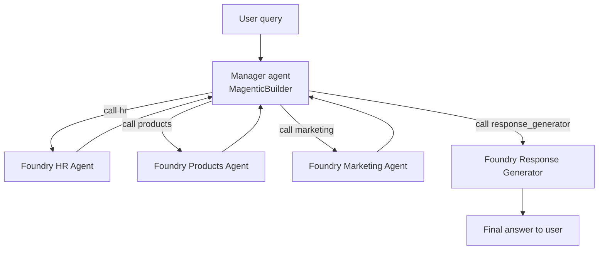

# Exercise 06 — Build the Magentic Orchestrator (Microsoft Agent Framework)

You now have three Foundry specialist agents. None of them know about each
other — and they shouldn't. You will build an **orchestrator** whose only job
is to break a user request into a plan, call the right specialists, and hand
the consolidated context to the Response Generator (Exercise 07).

We use the **Magentic / planner pattern** from the
[Microsoft Agent Framework](https://github.com/microsoft/agent-framework).
Magentic is a planning loop where a *manager* agent maintains a **progress
ledger**, picks a *participant* to call next, and decides when the task is
complete.

## Why Magentic over a flat router?

| Need | Flat router | Magentic |
| ---- | ----------- | -------- |
| Single-domain queries | Both fine | Both fine |
| Cross-domain queries ("our PTO + active Gatorade campaigns") | Hard | Native |
| Iteration / replanning when an answer is partial | No | Yes |
| Termination control (max rounds, stall detection) | Manual | Built in |

## Architecture

## Success criteria

{: .success }
> By the end of this exercise:
> - `python -m src.orchestrator.runner --query "..."` returns a final answer.
> - The printed plan shows which specialists were called.
> - For a cross-domain query, **multiple specialists** are called before the
>   response generator.

## Tasks

| Task | Description |
| ---- | ----------- |
| [06.01 — Magentic orchestration overview](06_01_magentic_overview.md) | Concepts: participants, manager, progress ledger, termination. |
| [06.02 — Walk through the orchestrator code](06_02_build_orchestrator.md) | Inspect `magentic_router.py`. |
| [06.03 — Run the orchestrator from the CLI](06_03_run_orchestrator.md) | Exercise it with single- and cross-domain queries. |
