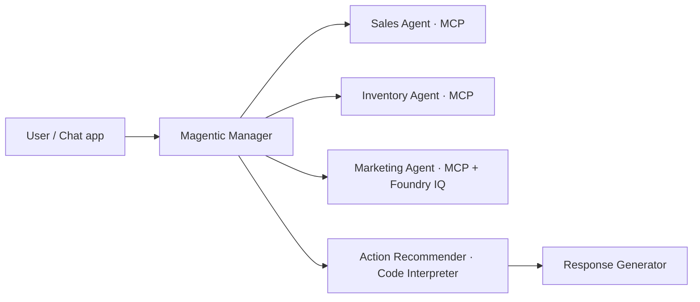
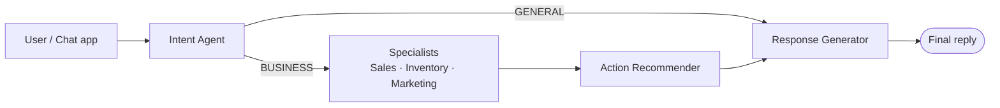

# Exercise 07 — Orchestrate the Agents (Magentic or Conditional Workflow)

## Scenario

Each specialist works in isolation, but real Zava questions cross domains:
*"Garden sales jumped this month — are we stocked, and is a campaign driving
it?"* A single agent can't answer that; an orchestrator can.

You will orchestrate the specialists with the **Microsoft Agent Framework**.
This exercise gives you **two orchestration options** that solve the same
problem in different ways:

| Option | Pattern | Who decides the route | When to choose it |
| ------ | ------- | --------------------- | ----------------- |
| **1 · Magentic** | A manager **LLM** plans which specialists to call, in what order | Model (dynamic) | Open-ended, cross-domain questions where the best plan isn't known up front |
| **2 · Conditional Workflow** | A **graph** with conditional edges routes the turn deterministically | Code (explicit rules) | Predictable flows you want to be reproducible, auditable and cheap |

Both finish by calling the **Action** recommender and the **Response
Generator**. Pick one to run, or build both and compare.

## Prerequisites

Both options use the **Sales, Inventory, Marketing and Action** agents
(Exercises 04–06 and 08), the **Intent** agent (Exercise 02) to gate the turn,
and the **Response Generator** (Exercise 09) to write the final reply — so a
complete end-to-end run needs the agents from Exercises 02–09.

---

## Option 1 — Magentic orchestrator (manager-planned)

A small **manager** model plans which specialists to call, in what order,
reusing shared keys (`store_id`, `region`, `category`, `product_id`,
`campaign_id`), and finishes by calling the **Action** recommender.



The manager always calls `action` last. Code:
[src/orchestrator/magentic_router.py](https://github.com/SinglaSandeep/ai-agents-workshop/blob/main/src/orchestrator/magentic_router.py).

### 1. Run a query from the CLI

```powershell
python -m src.orchestrator.runner --query "Which categories are trending and are we stocked for them?"
```

You'll see the manager's plan, each specialist's transcript, and the final
prioritised answer streamed to the console.

### 2. Explore the flow visually in DevUI

```powershell
python -m src.orchestrator.runner --devui
```

DevUI opens automatically (default port `8081`) and registers the whole
workflow as a single `zava_orchestrator` entity, so you can chat with the
orchestrator and watch the manager's plan and per-agent calls inline.

### Multi-agent challenges → how Magentic overcomes them

| Challenge | How the orchestrator solves it |
| --------- | ------------------------------ |
| Routing loops | Magentic manager plans via a shared task ledger |
| Context bloat | Each agent gets scoped context; Action/Response compose the answer |
| Cost & latency | Manager calls each needed agent once and skips irrelevant ones |
| Error propagation | `action` runs last and validates before the reply is written |

---

## Option 2 — Conditional Workflow (deterministic graph)

Instead of letting a manager LLM plan, you wire the agents into a **graph** and
route between them with **conditional edges**. The **Intent** agent classifies
the turn, and a condition function decides the path:

- `GENERAL` → go straight to the **Response Generator** (a friendly reply).
- `BUSINESS` → fan out to the specialists → **Action** → **Response Generator**.



This is a deterministic branch on the intent gate: you build it with
`WorkflowBuilder` and condition functions that inspect each agent's response:

```python
from agent_framework import AgentExecutorResponse, WorkflowBuilder, executor
from typing import Any


def is_general(message: Any) -> bool:
    return (
        isinstance(message, AgentExecutorResponse)
        and message.agent_response.text.strip().upper().startswith("GENERAL")
    )


def is_business(message: Any) -> bool:
    return (
        isinstance(message, AgentExecutorResponse)
        and message.agent_response.text.strip().upper().startswith("BUSINESS")
    )


# intent, specialists, action, response are Agent / executor nodes built
# from the same Foundry hosted agents used by the Magentic option.
workflow = (
    WorkflowBuilder(start_executor=intent)
    .add_edge(intent, response, condition=is_general)     # GENERAL → straight reply
    .add_edge(intent, specialists, condition=is_business) # BUSINESS → full path
    .add_edge(specialists, action)
    .add_edge(action, response)
    .build()
)
```

### When to prefer the Conditional Workflow

| Conditional Workflow gives you | …compared to Magentic |
| ------------------------------ | --------------------- |
| **Deterministic** routing — same input, same path | The manager may plan differently run to run |
| **Lower cost / latency** — no planner LLM in the loop | Every turn pays for manager planning |
| **Auditable** edges you can unit-test | Routing decisions live inside the manager's reasoning |
| Explicit code you own | The model owns the plan |

The trade-off: you encode the routing rules yourself, so it suits **known,
repeatable** flows. Reach for **Magentic** when the best plan is open-ended and
you want the model to decide.

## Success criteria

- **Option 1:** a mixed-domain query produces a plan that calls more than one
  specialist, `action` runs last, and the answer is grounded in the transcripts.
- **Option 2:** a `GENERAL` turn short-circuits straight to the Response
  Generator, while a `BUSINESS` turn flows through the specialists → Action →
  Response Generator.

## References

- [Microsoft Agent Framework](https://learn.microsoft.com/agent-framework/overview/agent-framework-overview)
- [Agent Framework samples (Python)](https://github.com/microsoft/agent-framework/tree/main/python/samples)
- [What is Foundry Agent Service?](https://learn.microsoft.com/azure/ai-foundry/agents/overview)
