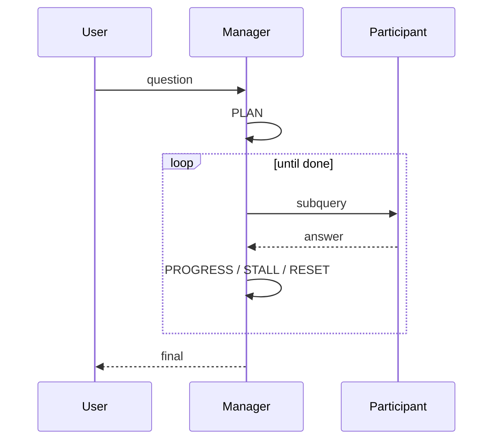

# Task 07.01 — Magentic in 5 Minutes

## Introduction

**Magentic** is a planner pattern in the Microsoft Agent Framework. You give
it a **manager agent** (LLM-only, no tools) plus a list of **participants**
(your specialist agents). For a given user query, the manager:

1. Drafts a plan (a short sequence of participant calls).
2. Executes the plan one step at a time, observing each result.
3. **Stalls** when participants disagree or fail and either retries the
   current step or **resets** the plan.
4. Hands off to a final synthesiser (you will plug in the Response Generator
   in Exercise 08).

This means your code does not pick which specialist to call — the manager
does, based on each agent's `description`.

## Mental model

## Concrete settings

In this workshop we cap rounds so the planner cannot run away:

* `max_round_count=8`
* `max_stall_count=2`
* `max_reset_count=1`

If you raise these, watch out for cost — every round is at least one
manager + one participant model call.

## Success Criteria

You can explain in your own words:

* What a *participant* is and where its `description` shows up.
* The difference between a *stall* and a *reset*.
* Why the response generator is always the final participant.

## Next

Continue to [07.02 — Build the orchestrator](07_02_build_orchestrator.md).
