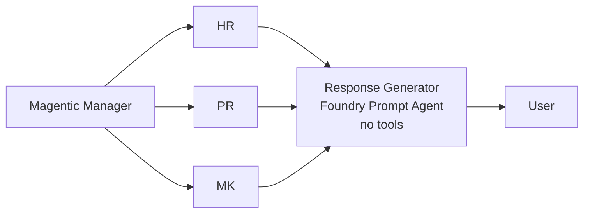

# Exercise 07 — Add the Response Generator Foundry Prompt Agent

The orchestrator can already produce specialist answers. They are not
particularly user-friendly — they are raw transcripts. The **Response
Generator** is a final Foundry Prompt Agent (no tools) whose only job is to
synthesise the specialists' outputs into a single, well-formatted reply in
Pepsico's voice.

## Why a separate agent?

| Reason | Why it matters |
| ------ | -------------- |
| **Separation of concerns** | The specialists own correctness; the generator owns presentation. |
| **Reusability** | Other orchestrators (e.g. a future support-ticket workflow) can re-use the same response style. |
| **Easy tuning** | You can tweak tone, length, or citation style without touching the specialists. |

## Architecture (final shape)

## Success criteria

{: .success }
> By the end of this exercise:
> - A Foundry agent named `pepsico-response-generator` exists, with NO tools.
> - The orchestrator's final answer is always written by this agent.
> - Output follows the structure: one-sentence answer + 1-3 short paragraphs +
>   `Sources:` line.

## Tasks

| Task | Description |
| ---- | ----------- |
| [07.01 — Create the Response Generator agent](07_01_create_response_agent.md) | Run `create_response_agent.py`. |
| [07.02 — Wire it into the orchestrator](07_02_wire_into_orchestrator.md) | Already wired by Exercise 06 — verify with end-to-end tests. |
