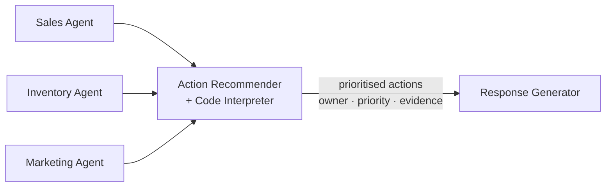

# Exercise 08 — Create the Action Recommender Agent

## Scenario

Insights are only useful if they lead to a decision. The **Action
Recommender** sits downstream of the Sales, Inventory and Marketing
specialists and turns their insights into a short, prioritised set of
concrete cross-domain operational **actions**. It owns the Foundry **Code
Interpreter** tool because it has the full cross-domain context needed to
consolidate figures, and it always runs **last** in the Magentic flow.

## How it fits together



The Action Recommender always runs **last** among the specialists, so it sees
every insight before composing the recommendations.

## What you will build

A Foundry Prompt Agent `zava-action-agent` with the Code Interpreter tool
that produces prioritised actions (owner · priority · evidence) and an
optional chart spec the front end renders.

## Steps

### Option 1 — Portal

1. Go to the [Foundry portal](https://ai.azure.com), open your workshop project, and choose **Build** → **Agents**.
2. Select **Create agent**.
3. In **Setup**, use these values:

    | Field | Value |
    | ----- | ----- |
    | Agent name | `zava-action-agent` |
    | Model deployment | Your `AZURE_AI_MODEL_DEPLOYMENT` value, usually `gpt-4.1-mini` |
    | Instructions | Paste the `system:` body from `src/prompts/action_agent.prompty` |

4. In **Tools**, select **Add** → **Code Interpreter**.
5. Keep the default Code Interpreter container settings. This lab does not upload files to the agent; it uses Code Interpreter only for consolidating numbers already supplied by the specialists.
6. Save or create the agent, then open **Try in playground**.

### Option 2 — Script

```powershell
python -m src.foundry_agents.create_action_agent
```

Code:
[src/foundry_agents/create_action_agent.py](https://github.com/SinglaSandeep/ai-agents-workshop/blob/main/src/foundry_agents/create_action_agent.py).

{: .note }
> **Verify it worked:** confirm `zava-action-agent` appears in the
> [Foundry portal](https://ai.azure.com) under **Agents**.

## Success criteria

- `zava-action-agent` exists in your Foundry project.
- Given specialist insights, it returns 2–5 prioritised actions, each with an
  owner, a priority, and the evidence (specialist + figure/ID) behind it.
- It uses Code Interpreter only to consolidate numbers already provided —
  never to invent inputs.

## Test it

Run a mixed-domain query through the orchestrator (Exercise 07) and confirm
`action` runs last and shapes the final recommendations.

## References

- [Code Interpreter tool](https://learn.microsoft.com/azure/ai-foundry/agents/how-to/tools/code-interpreter)
- [Foundry agent tools catalog](https://learn.microsoft.com/azure/ai-foundry/agents/concepts/tool-catalog)
- [Agent Framework samples (Python)](https://github.com/microsoft/agent-framework/tree/main/python/samples)
