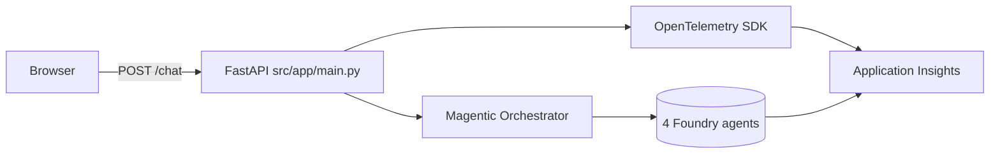

# Exercise 08 — Wire the Chat App & Add Observability

You will:
1. Run the FastAPI chat application against the live multi-agent orchestrator.
2. Optionally turn on OpenTelemetry → Application Insights so every chat
   request flows as a distributed trace you can inspect in Foundry Tracing
   and Azure Monitor.

## Architecture

## Success criteria

{: .success }
> By the end of this exercise:
> - `uvicorn src.app.main:app --reload --port 8000` serves the chat UI at
>   <http://127.0.0.1:8000>.
> - A round-trip from the browser → orchestrator → 4 Foundry agents →
>   final reply works end-to-end.
> - (Optional) Each `/chat` request appears in Application Insights with a
>   distributed trace spanning FastAPI, the orchestrator, and Foundry.

## Tasks

| Task | Description |
| ---- | ----------- |
| [08.01 — Run the FastAPI chat app](08_01_fastapi_chat.md) | Local web UI and CLI. |
| [08.02 — Add observability to Application Insights / Foundry](08_02_observability.md) | Enable the `[observability]` extras and the `APPLICATIONINSIGHTS_CONNECTION_STRING`. |
