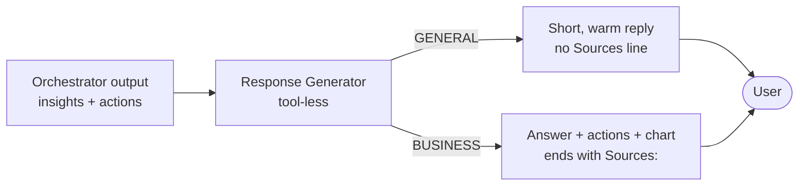

# Exercise 09 — Create the Response Generator Agent

## Scenario

The orchestrator and Action agent produce structured insights and
recommendations. The **Response Generator** is a tool-less agent whose only
job is to write the final reply in a consistent Zava voice. It handles two
cases:

- **GENERAL** turns (greetings, small talk) — a brief, warm reply with no
  chart or sources.
- **BUSINESS** turns — a direct answer plus the prioritised actions, keeping
  any chart block the Action agent produced and ending with a `Sources:` line.

## How it fits together



## What you will build

A tool-less Foundry Prompt Agent `zava-response-generator` that turns the
orchestrator output into the polished final answer.

## Steps

### Option 1 — Portal

1. Go to the [Foundry portal](https://ai.azure.com), open your workshop project, and choose **Build** → **Agents**.
2. Select **Create agent**.
3. In **Setup**, use these values:

    | Field | Value |
    | ----- | ----- |
    | Agent name | `zava-response-generator` |
    | Model deployment | Your `AZURE_AI_MODEL_DEPLOYMENT` value, usually `gpt-4.1-mini` |
    | Instructions | Paste the `system:` body from `src/prompts/response_agent.prompty` |

4. Leave **Tools** empty. This agent is intentionally tool-less.
5. Save or create the agent, then open **Try in playground**.

### Option 2 — Script

```powershell
python -m src.foundry_agents.create_response_agent
```

Code:
[src/foundry_agents/create_response_agent.py](https://github.com/SinglaSandeep/ai-agents-workshop/blob/main/src/foundry_agents/create_response_agent.py).

{: .note }
> **Verify it worked:** confirm `zava-response-generator` appears in the
> [Foundry portal](https://ai.azure.com) under **Agents**.

## Success criteria

- `zava-response-generator` exists in your Foundry project.
- GENERAL turns get a short, warm reply with no `Sources:` line.
- BUSINESS turns surface the actions prominently and end with `Sources:`.

## Test it

```powershell
uvicorn src.app.main:app --port 8000
```

Ask both a greeting and a cross-domain business question and confirm the two
response styles.

## References

- [What is Foundry Agent Service?](https://learn.microsoft.com/azure/ai-foundry/agents/overview)
- [Prompt engineering techniques](https://learn.microsoft.com/azure/ai-foundry/openai/concepts/prompt-engineering)
- [Agent Framework samples (Python)](https://github.com/microsoft/agent-framework/tree/main/python/samples)
