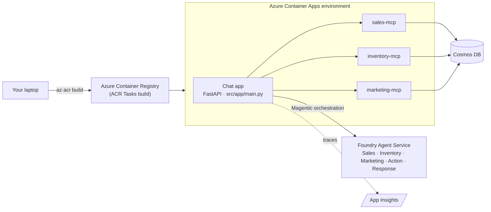

# Exercise 10 — Deploy the Chat App to Azure

## Scenario

Everything works locally — now put it in front of store managers. The MCP
servers (Module 2) and Foundry agents are already deployed, so this exercise
just ships the **FastAPI chat app** to **Azure Container Apps**.

## What you deploy

| Component | Where |
| --------- | ----- |
| Chat app (FastAPI) | `src/app/main.py` → Azure Container Apps (this exercise) |
| Sales / Inventory / Marketing MCP servers | Azure Container Apps (Module 2) |
| Foundry agents | already provisioned in your Foundry project |

## Deployment topology



## Optional — one scripted deploy

{: .warning }
> **Do not run this during the workshop.** It is provided only as a convenience
> reference for after the event. Follow the manual steps below so you can see
> what each part does.

A helper script at the repo root performs every manual step below
(build → create/update → grant the app identity its roles → print the URL) and
is safe to re-run after code changes:

```powershell
./scripts/deploy-chat-app.ps1
```

It reads `ACR_NAME`, `ACA_ENVIRONMENT`, `AZURE_RESOURCE_GROUP`,
`AZURE_AI_PROJECT_ENDPOINT`, and `AZURE_AI_MODEL_DEPLOYMENT` from your `.env`,
and prompts securely for the Basic-auth password (never stored in source).

## Steps

### 1. Run the chat app locally first

Before deploying, confirm the full assistant works end to end on your laptop.
The same `src/app/main.py` you'll ship runs locally with uvicorn. Basic auth is
**disabled automatically** when `BASIC_AUTH_USERNAME` / `BASIC_AUTH_PASSWORD`
are unset, so no credentials are needed for local dev:

```powershell
uvicorn src.app.main:app --port 8000
```

Open [http://localhost:8000](http://localhost:8000) and ask a cross-domain Zava
question (for example, *"Which paint campaigns are underperforming and what
should we do about stock?"*). You should see the orchestrator plan and per-agent
transcripts stream in the uvicorn console.

{: .note }
> This uses the **same Foundry agents and MCP servers** as the cloud
> deployment — only the frontend moves to Azure in the next steps. Make sure the
> three MCP servers (Module 2) are reachable via their `*_MCP_URL` values in
> `.env`. Press `Ctrl+C` to stop the local server before deploying.

### 2. Build the chat app image into ACR

No local Docker is required — Azure Container Registry builds the image for
you from the repo root `Dockerfile`:

```powershell
$env:PYTHONIOENCODING = 'utf-8'
az acr build -r $env:ACR_NAME -t zava-chat-app:latest --no-logs .
```

### 3. Create the Container App

```powershell
$BASIC_PWD = 'choose-a-strong-password'   # single quotes keep $ literal
az containerapp create `
  --name zava-chat-app `
  --resource-group $env:AZURE_RESOURCE_GROUP `
  --environment   $env:ACA_ENVIRONMENT `
  --image "$env:ACR_NAME.azurecr.io/zava-chat-app:latest" `
  --target-port 8000 --ingress external --system-assigned `
  --secrets "basic-auth-password=$BASIC_PWD" `
  --env-vars `
      BASIC_AUTH_USERNAME=demo-admin `
      BASIC_AUTH_PASSWORD=secretref:basic-auth-password `
      AZURE_AI_PROJECT_ENDPOINT=$env:AZURE_AI_PROJECT_ENDPOINT `
      AZURE_AI_MODEL_DEPLOYMENT=$env:AZURE_AI_MODEL_DEPLOYMENT `
      ORCHESTRATOR_MODEL_CHOICES="gpt-4.1,gpt-4.1-mini,gpt-4o,gpt-4o-mini"
```

### 4. Grant the app's managed identity access

Grant the system-assigned identity `AcrPull` on your ACR and
`Azure AI Developer` + `Cognitive Services User` on the Foundry account so the
app can pull its image and call your agents.

### 5. Open the deployed app

Get the URL and open it:

```powershell
az containerapp show --name zava-chat-app `
  --resource-group $env:AZURE_RESOURCE_GROUP `
  --query properties.configuration.ingress.fqdn -o tsv
```

Sign in with the Basic-auth credentials and ask a cross-domain Zava question
to confirm the full orchestration runs in the cloud.

## Try these insight questions

Whether you run locally (Step 1) or against the deployed app, use these five
prompts to exercise the assistant from a **single domain** through to a
**multi-domain insight-to-action** request. They are designed around the shared
Zava dataset (sales, distributor inventory, and marketing campaigns + Foundry IQ
briefs/post-mortems), and the later ones ask the **Action Recommender** to emit
a `chart` block that the chat app renders with Chart.js.

| # | Scope | Ask this |
| - | ----- | -------- |
| 1 | **Sales only** (insight + chart) | *"Which paint SKUs are underperforming on revenue this year, and show the monthly paint sales trend as a chart."* |
| 2 | **Inventory only** (insight → action) | *"Across the North region, which SKUs are low or stocked out right now, and what reorder quantities do you recommend?"* |
| 3 | **Marketing + knowledge** (two sources) | *"How is the Spring Paint Sale 2026 campaign tracking against its budget and KPIs, and what did last year's spring paint post-mortem warn us about?"* |
| 4 | **Sales + Inventory + Marketing** (insight-to-action + chart) | *"Our Spring Paint Sale in Seattle looks soft. Combine paint sales, current paint inventory, and the active campaign to explain what's going wrong and what to do — include a chart of paint sales vs. available stock."* |
| 5 | **All domains** (strategic action + chart) | *"Which category gives us the best margin-to-stock-risk tradeoff next quarter? Compare category revenue and margin against overstock and low-stock counts, recommend where to push promotions, and visualize it."* |

{: .tip }
> Questions 1–2 should each resolve through a **single specialist** quickly.
> Questions 4–5 force the **Magentic orchestrator** to fan out across all three
> MCP-backed agents, pull from the Foundry IQ knowledge base, and finish with the
> Action Recommender's chart — the full insight-to-action loop you built across
> Modules 2–5.

## Success criteria

- The chat app URL loads and answers a business question end to end.
- Traces for the deployed turns appear in Application Insights.

{: .tip }
> Keep the `zava-chat-app` name and your resource group handy — you'll need
> them for cleanup in the next exercise.

## References

- [Azure Container Apps — quickstart](https://learn.microsoft.com/azure/container-apps/get-started)
- [Build & push an image with `az acr build`](https://learn.microsoft.com/azure/container-registry/container-registry-tutorial-quick-task)
- [`az containerapp` CLI reference](https://learn.microsoft.com/cli/azure/containerapp)
