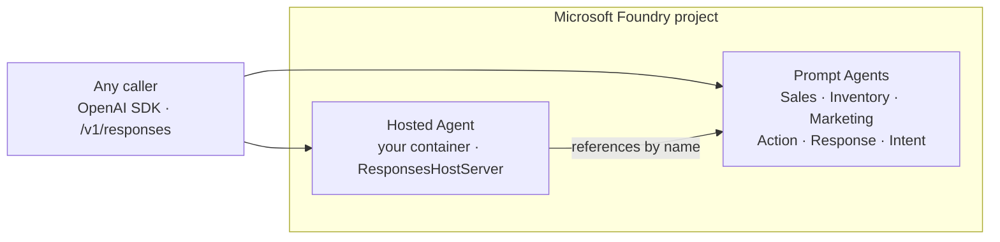
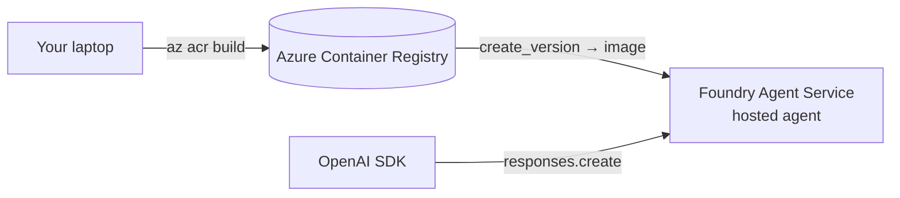

# Exercise 11 — Foundry Hosted Agents (Optional)

{: .note }
> **Optional exercise.** The assistant is already complete and deployed after
> Exercise 10. This exercise is an alternative hosting model — skip it if you
> only need the self-hosted chat app.

## Two ways to run an agent on Foundry

Through the workshop you've actually used **both** kinds of Foundry agent —
this exercise makes the distinction explicit.

| | **Prompt Agent** | **Hosted Agent** |
| --- | --- | --- |
| What it is | A declarative agent — model + instructions + tools | **Your own code** (an Agent Framework `Agent` or `Workflow`) packaged in a container |
| You built it in | Modules 1, 3–5 (Intent, Sales, Inventory, Marketing, Action, Response) | The Marketing agent (Exercise 06) is the first example |
| Where the logic lives | In the Foundry agent **definition** | In **Python you wrote** (custom routing, memory, tool orchestration) |
| How Foundry runs it | Foundry executes the prompt against the model | Foundry runs **your container** and exposes it through the **Responses API** |
| Reach for it when | The behaviour is "instructions + tools" | You need custom control flow the model can't express declaratively |

In other words: a **Prompt Agent** is configuration; a **Hosted Agent** is your
application, run *by Foundry* so callers reach it through the same project
endpoint and Responses API as every other agent — no separate web app to
operate.



## Why host your orchestrator on Foundry?

The Zava orchestrator ([src/orchestrator/magentic_router.py](https://github.com/SinglaSandeep/ai-agents-workshop/blob/main/src/orchestrator/magentic_router.py))
is custom Agent Framework code — a Magentic manager plus an intent gate and a
response stage. In [Exercise 10](../10_deploy_chat_app/10_deploy_chat_app.md) you
ship it inside the FastAPI chat app on Container Apps. Hosting it as a **Foundry
hosted agent** instead gives you:

- **One front door.** Callers use the Foundry project endpoint + Responses API
  for *all* agents — no separate app URL or auth to manage.
- **Managed runtime.** Foundry runs and scales the container and injects
  identity, so you don't operate a web tier just to expose the orchestrator.
- **Composability.** A hosted agent can reference your Prompt Agents by name,
  so the orchestrator keeps delegating to the specialists exactly as today.

## How hosting works

The Agent Framework ships a hosting package,
**`agent-framework-foundry-hosting`**, whose `ResponsesHostServer` wraps any
Agent Framework agent and serves it over the OpenAI-compatible Responses API
that Foundry expects:

```python
from agent_framework_foundry_hosting import ResponsesHostServer

# `agent` is any Agent Framework Agent or WorkflowAgent — e.g. the Zava
# orchestrator workflow. The host serves it at /v1/responses.
server = ResponsesHostServer(agent)
server.serve()
```

{: .note }
> **Stateless by contract.** The hosting runtime manages history and
> checkpoints, so a hosted agent must **not** keep conversation state in
> process memory — rely on the runtime-managed history rather than a local
> dict.

The package is a **pre-release** at workshop time, so it lives in the optional
`hosted` extra rather than the default install (see
[pyproject.toml](https://github.com/SinglaSandeep/ai-agents-workshop/blob/main/pyproject.toml)):

```bash
pip install --pre "agent-framework-foundry-hosting>=0.3.0a0"
```

## Deploy flow (high level)

Hosting a custom agent follows the same container path as the MCP servers, with
one extra step — registering the image as an **agent version** in Foundry:



1. **Wrap the agent.** Add a small entrypoint that builds the orchestrator
   workflow and serves it with `ResponsesHostServer(agent).serve()`.
2. **Containerise it.** A Dockerfile that installs the `hosted` extra and runs
   that entrypoint. The container must include `mcp>=1.9.0` (the hosting
   runtime imports `McpError`).
3. **Build into ACR.** `az acr build -r <acr> -t zava-orchestrator:latest .`
   — public network access must be enabled on the registry.
4. **Register the version.** Create an agent version that points at the image,
   the same `create_version` call used for Prompt Agents in
   [src/foundry_agents/_common.py](https://github.com/SinglaSandeep/ai-agents-workshop/blob/main/src/foundry_agents/_common.py),
   but with a container (hosted) definition instead of a prompt definition.
5. **Grant pull rights.** The **project's own managed identity** (not the
   account identity) needs the **AcrPull** role on the registry, or the agent
   fails to pull its image.

## Invoke a hosted agent

Once registered, you call a hosted agent through the **Responses API** using the
project's OpenAI-compatible client — the same surface DevUI exposes locally in
[src/app/devui_launch.py](https://github.com/SinglaSandeep/ai-agents-workshop/blob/main/src/app/devui_launch.py):

```python
from src.common.foundry_client import get_project_client

project = get_project_client()
client = project.get_openai_client(agent_name="zava-orchestrator")
resp = client.responses.create(
    model="zava-orchestrator",          # the hosted agent name
    input="How did the garden category trend last month?",
)
print(resp.output_text)
```

{: .important }
> **Version pinning gotcha.** A Responses conversation is pinned to whatever
> version was `@latest` when it **started**. After you deploy a fixed version,
> existing conversations keep hitting the **old** container — start a **new
> conversation** to route to the new `@latest`. Stale versions can't be deleted
> until their sessions go idle (~15 min): `Version has N active session(s)`.

## When to host vs. self-deploy

| Host on Foundry (this exercise) | Self-deploy on Container Apps ([Exercise 10](../10_deploy_chat_app/10_deploy_chat_app.md)) |
| --- | --- |
| One endpoint + auth for every agent | You own the web tier, routing and scaling |
| Managed runtime, identity injected | Full control of the process and framework (FastAPI, SSE UI) |
| Best for exposing the **agent** itself | Best when you also ship a **custom UI / API** around it |

Both are valid — many teams **self-host the chat UI** (the FastAPI app) while
**hosting the orchestrator agent** on Foundry behind it.

## What you learned

- The difference between a Foundry **Prompt Agent** (declarative) and a
  **Hosted Agent** (your container, run by Foundry).
- How `agent-framework-foundry-hosting` / `ResponsesHostServer` turns Agent
  Framework code into a Foundry-hosted agent on the Responses API.
- The deploy path (ACR build → `create_version` → AcrPull on the **project**
  identity) and how to invoke a hosted agent with `responses.create`.
- Why hosted agents must stay stateless — and how the runtime-managed history
  keeps them that way.

## References

- [What are agents in Foundry?](https://learn.microsoft.com/azure/ai-foundry/agents/overview)
- [Foundry Agent Service — Responses API](https://learn.microsoft.com/azure/ai-foundry/agents/concepts/responses-api)
