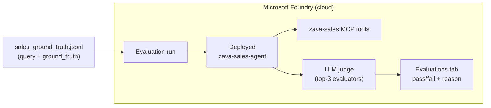

# Exercise 12 — Evaluate the Sales Agent

## Scenario

You built the **Sales agent** in Module 2. It turns Zava sales data into
decision-ready insight bullets by calling the `zava-sales` MCP tools. But how do
you *know* it is doing a good job — picking the right tool, understanding the
question, and following its instructions? You evaluate it.

In this exercise you run a **cloud evaluation** in Microsoft Foundry. Foundry
runs your deployed agent server-side against a small ground-truth dataset and
scores every answer with built-in **AI-assisted evaluators**. Results appear in
the Foundry **Evaluations** tab with a pass/fail and a reason for each item.

## The top 3 evaluators

For an MCP-backed insights agent, these three matter most:

| # | Evaluator | Question it answers | Built-in name |
| - | --------- | ------------------- | ------------- |
| 1 | **Intent Resolution** | Did the agent correctly understand the sales question? | `builtin.intent_resolution` |
| 2 | **Tool Call Accuracy** | Did it call the right `zava-sales` tool with the right arguments? | `builtin.tool_call_accuracy` |
| 3 | **Task Adherence** | Did the answer follow the Sales Specialist prompt (quantified, 1–3 bullets, tool-only figures)? | `builtin.task_adherence` |

Each evaluator returns a 1–5 score, a **pass/fail** against a threshold, and a
plain-language **reason** you can read in the portal.

## How it works



You never run the agent locally — Foundry executes it for each row, captures the
tool calls and final answer, then scores them.

## Prerequisites

Before starting, confirm that:

- The **Sales agent is deployed**:

  ```powershell
  python -m src.foundry_agents.create_sales_agent
  ```

- You are signed in to the workshop subscription (`az login` or `azd auth login`).
- Your `.env` includes `AZURE_AI_PROJECT_ENDPOINT`, `AZURE_AI_MODEL_DEPLOYMENT`,
  and `SALES_AGENT_NAME` (defaults to `zava-sales-agent`).
- The evaluation extras are installed (already covered by the base install; the
  cloud flow only needs `azure-ai-projects` and `openai`).

## Files in this exercise

| File | Purpose |
| ---- | ------- |
| [src/evaluations/eval_data/sales_ground_truth.jsonl](https://github.com/SinglaSandeep/ai-agents-workshop/blob/main/src/evaluations/eval_data/sales_ground_truth.jsonl) | 10 in-scope questions + 5 challenge (negative) cases |
| [src/evaluations/sales_tool_definitions.py](https://github.com/SinglaSandeep/ai-agents-workshop/blob/main/src/evaluations/sales_tool_definitions.py) | OpenAI-style schema for the `zava-sales` tools (Tool Call Accuracy needs it) |
| [src/evaluations/sales_quality_eval.py](https://github.com/SinglaSandeep/ai-agents-workshop/blob/main/src/evaluations/sales_quality_eval.py) | The runnable cloud evaluation (top-3 evaluators) |

## The dataset

Each line is a realistic Zava sales question plus a short reference answer
describing what a good response looks like:

```json
{"query": "Which product category is generating the most revenue right now?", "ground_truth": "Calls revenue_summary(group_by=category) and reports the single top category by revenue_usd with a figure."}
```

Add your own rows to grow coverage — one line per question.

### Challenge cases (negative tests)

If every row scores 5/5, the dataset is too easy to tell you anything. The last
**5 rows are deliberately hard** — each one stresses a specific evaluator so you
see a sub-5 score with a concrete reason you can act on. This is where the real
learning happens.

| Challenge query | Stresses | Why it is hard | How to improve the agent |
| --------------- | -------- | -------------- | ------------------------ |
| "How are we doing this quarter?" | Intent Resolution | Vague — no metric or dimension named, so the agent may guess wrong or answer generically | Teach the prompt to **state the assumption** it made or **ask one clarifying question** when a request is ambiguous |
| "What were the total sales for our best-selling paint product?" | Tool Call Accuracy | Needs **two chained calls** — `top_products(category=paint, limit=1)` to find the id, then `sales_for_product(id)` | Add explicit "chain tools: find the id first, then look it up" guidance; never guess a `product_id` |
| "Forecast next quarter's paint revenue for me." | Task Adherence | There is **no forecasting tool** — the agent may invent a number | Add a rule: report historical figures only; decline forecasts and offer the recent trend instead |
| "Which individual customer order was the largest this year?" | Tool Call Accuracy + Task Adherence | No tool ranks orders, and `get_order` needs a specific id — tempting to fabricate | Instruct the agent to say it **cannot** do something no tool supports, rather than calling a tool with a guessed argument |
| "Why did garden sales jump last month?" | Task Adherence / grounding | Tools return **figures, not reasons** — the agent may invent a cause | Add a rule: present the trend and avoid asserting causes the data does not support |

These map directly to the **Act on the findings** loop below: read the failing
`reason`, edit `src/prompts/sales_agent.prompty`, re-deploy, and re-run.

## Steps

### 1. Review the evaluator configuration

Open [src/evaluations/sales_quality_eval.py](https://github.com/SinglaSandeep/ai-agents-workshop/blob/main/src/evaluations/sales_quality_eval.py).
The `TOP_3_EVALUATORS` list defines the three built-in evaluators and how each
field is mapped from the dataset:

- `{{item.query}}` — the user question from your dataset.
- `{{sample.output_items}}` — the agent's full run (tool calls + result),
  produced server-side. Tool Call Accuracy needs this.
- `{{item.tool_definitions}}` — injected from `sales_tool_definitions.py` so the
  judge knows which tools the agent *could* have called.

### 2. Run the evaluation

```powershell
python -m src.evaluations.sales_quality_eval
```

The script will:

1. Look up the latest deployed `zava-sales-agent` version.
2. Upload the ground-truth dataset (augmented with tool definitions).
3. Create the evaluation and a run targeting the agent.
4. Poll until the run completes and print a **report URL**.
5. Save per-item results to `src/evaluations/eval_output/`.

### 3. Inspect the results in Foundry

1. Open the **report URL** the script prints, or go to
   [Microsoft Foundry](https://ai.azure.com) → your project → **Evaluations**.
2. Open the run named **`Sales Quality Eval Run - zava-sales-agent`**.
3. For each row, review the three evaluators:
   - **Intent Resolution** — was the question understood?
   - **Tool Call Accuracy** — was the correct tool called with correct args?
   - **Task Adherence** — did the answer follow the prompt?
4. Click any **fail** and read the `reason` to see *why* it failed.

{: .note }
> Expect the first 10 rows to pass and the **5 challenge rows to score lower** —
> that is by design. A mix of pass and fail is exactly what a useful evaluation
> set looks like; it gives you a baseline to improve against.

### 4. Act on the findings

Common fixes when a metric fails:

| Symptom | Likely fix |
| ------- | ---------- |
| Tool Call Accuracy low | Tighten tool guidance in `src/prompts/sales_agent.prompty` |
| Task Adherence low | Reinforce the "1–3 bullets, tool figures only" rules in the prompt |
| Intent Resolution low | Clarify ambiguous dataset questions, or improve the system prompt |

Re-deploy the agent and re-run the evaluation to confirm the score improves.
This deploy → evaluate → fix loop is how you catch regressions before users do.

## Learning resources

- [Evaluate your AI agents](https://learn.microsoft.com/azure/ai-foundry/observability/how-to/evaluate-agent)
- [Agent evaluators reference](https://learn.microsoft.com/azure/ai-foundry/concepts/evaluation-evaluators/agent-evaluators)
- [Run evaluations from the SDK (cloud)](https://learn.microsoft.com/azure/ai-foundry/how-to/develop/cloud-evaluation)

{: .note }
> **Next:** harden the agent against misuse in
> [Exercise 14 — Guardrails & Red Teaming](../14_guardrails_red_teaming/14_guardrails_red_teaming.md).
