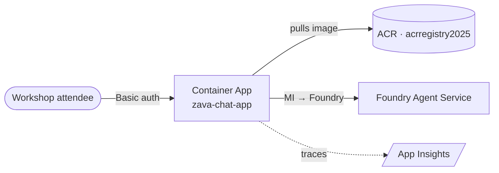

# Exercise 13 — Deploy the Zava Chat App to Azure Container Apps

## Scenario

You have a working multi-agent assistant on `http://localhost:8000`. To
share it with stakeholders for a workshop demo you need:

1. A public HTTPS URL.
2. **HTTP Basic auth** in front of it so only invited attendees can use it.
3. A way to **swap the orchestrator (manager) model at runtime** — without
   rebuilding the image — so you can A/B `gpt-4.1`, `gpt-4o`, etc., live
   during the demo.

This exercise containerises the FastAPI chat app, pushes the image to
Azure Container Registry (ACR), creates a Container App with a
system-assigned managed identity, grants the identity Foundry data-plane
roles, and verifies the live URL.

> The four MCP/Foundry **agents** themselves were already deployed in
> earlier exercises. This module only deploys the *web app* that drives
> them.

## Success Criteria

{: .success }
> - The image `zava-chat-app:latest` exists in your ACR.
> - A Container App named `zava-chat-app` is `Running` in the workshop
>   ACA environment with external HTTPS ingress on port 8000.
> - `GET /health` returns `{"status":"ok"}` (no auth required).
> - `GET /` without credentials returns **HTTP 401**.
> - `GET /` with the workshop credentials returns **HTTP 200** and the
>   chat UI loads.
> - `GET /models` returns the orchestrator model picker choices.
> - The dropdown above the chat input lets you switch the orchestrator
>   model per request, with no redeploy.

## Architecture additions

## Tasks

| Task | Description |
| ---- | ----------- |
| [13.01 — Add Basic auth + model picker](13_01_basic_auth_and_model_picker.md) | What changed in `src/app/main.py`, `chat.html`, and `magentic_router.py`. |
| [13.02 — Build the image with ACR Tasks](13_02_build_image.md) | `az acr build` from the repo root using the root `Dockerfile`. |
| [13.03 — Create the Container App](13_03_create_container_app.md) | Provision with secrets, managed identity, env vars. |
| [13.04 — Grant Foundry roles to the MI](13_04_grant_roles.md) | `AcrPull`, `Azure AI Developer`, `Cognitive Services User`. |
| [13.05 — Verify and update](13_05_verify_and_update.md) | Smoke-test, swap models live, rebuild + restart. |

## Next

After verifying, continue to [Exercise 12 — Resource Cleanup](../12_cleanup/12_cleanup.md)
when you are done with the demo.
