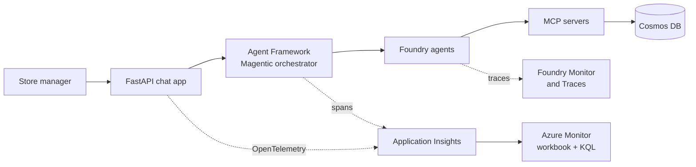

# Exercise 13 — Observe the Agents in Production

## Scenario

The Zava assistant is distributed: a single question can fan out across the
chat app, orchestrator, hosted Foundry agents, MCP servers, Cosmos DB, Foundry
IQ retrieval and model calls. When something is slow or wrong, one component's
logs aren't enough.

In this exercise you enable **Application Insights** with OpenTelemetry
tracing, generate traffic, and inspect runs, latency, tokens, errors and
traces in Foundry + Azure Monitor.

## What you will observe

| Signal | Where you inspect it |
| ------ | -------------------- |
| Agent runs, tool calls, and errors | Microsoft Foundry agent Monitor and Traces tabs |
| Token usage and estimated cost | Foundry Monitor dashboard and Application Insights |
| Request latency | Application Insights requests, dependencies, and traces |
| MCP and HTTP dependencies | Application Insights dependency telemetry |
| Custom spans | `zava.chat` and `zava.chat.stream` spans from the chat app |

## Learning resources

- [Observability in generative AI](https://learn.microsoft.com/azure/ai-foundry/concepts/observability)
- [Trace and observe AI agents in Microsoft Foundry](https://learn.microsoft.com/azure/ai-foundry/how-to/develop/trace-agents-sdk)
- [Monitor your generative AI applications](https://learn.microsoft.com/azure/ai-foundry/how-to/monitor-applications)
- [Azure Monitor OpenTelemetry for Python](https://learn.microsoft.com/azure/azure-monitor/app/opentelemetry-enable)

{: .warning }
> Recording full prompt and response content can capture sensitive business or
> personal data. For this workshop, use synthetic Zava data only and do not send
> secrets, credentials, or real customer information through the chat app.

## Prerequisites

Before starting, confirm that:

- Exercise 12 is complete or you understand the evaluation results you want to
  monitor over time.
- Your Azure resource group includes an Application Insights resource.
- Your `.env` file includes `APPLICATIONINSIGHTS_CONNECTION_STRING`.
- The optional observability dependencies are installed:

```powershell
pip install -e ".[observability]"
```

## How it works



The chat app calls
`configure_observability(app)` from
[src/common/observability.py](https://github.com/SinglaSandeep/ai-agents-workshop/blob/main/src/common/observability.py). When
`APPLICATIONINSIGHTS_CONNECTION_STRING` is present, the helper configures Azure
Monitor export and instruments FastAPI and HTTPX. The chat endpoints in
[src/app/main.py](https://github.com/SinglaSandeep/ai-agents-workshop/blob/main/src/app/main.py) also create custom spans named
`zava.chat` and `zava.chat.stream` so each request is easy to find in traces.

## Steps

### 1. Connect Application Insights to your Foundry project

1. Open [Microsoft Foundry](https://ai.azure.com).
2. Select your workshop project.
3. Open **Build**.
4. Select **Agents**.
5. Open any Zava agent, such as `zava-inventory-agent`.
6. Select the **Monitor** tab.
7. If prompted, select **Connect** and choose your Application Insights
   resource.

This connection lets Foundry dashboards and traces use the same telemetry store
as Azure Monitor.

### 2. Configure local telemetry

Set the Application Insights connection string in your `.env` file:

```text
APPLICATIONINSIGHTS_CONNECTION_STRING="InstrumentationKey=...;IngestionEndpoint=..."
OTEL_SERVICE_NAME="zava-agents-workshop"
```

For workshop debugging, you may also enable generative-AI content recording:

```text
AZURE_TRACING_GEN_AI_CONTENT_RECORDING_ENABLED="true"
```

If you enable content recording, keep the prompts synthetic and workshop-only.

### 3. Start the chat app with telemetry enabled

Start the app from the repository root:

```powershell
uvicorn src.app.main:app --port 8000
```

Open [http://127.0.0.1:8000](http://127.0.0.1:8000) and check the health
endpoint if you want to verify telemetry initialization:

```powershell
Invoke-RestMethod http://127.0.0.1:8000/health
```

The response should include `observability_enabled: true` when the connection
string and dependencies are available.

### 4. Generate representative traffic

Send a mix of questions so the orchestrator exercises multiple paths:

- `What were the strongest paint campaign signals last week?`
- `Which categories have inventory risk for the Seattle store?`
- `Compare sales momentum and inventory for exterior paint.`
- `What action should the regional manager take today?`
- `Hello, what can you help with?`

Let each response complete before sending the next prompt. This creates cleaner
trace sequences and easier row-by-row inspection.

### 5. Review Foundry agent traces

1. In Microsoft Foundry, open **Build** > **Agents**.
2. Select `zava-marketing-agent` or another specialist.
3. Open the **Traces** tab.
4. Select a recent completed run.
5. Review the ordered steps: model reasoning, tool selection, tool calls, and
   response output.

Use traces to answer debugging questions such as:

- Did the orchestrator call the expected specialist?
- Did the specialist call its MCP server or knowledge base?
- Did the tool return the data needed for the final answer?
- Which step consumed the most time or tokens?

### 6. Review operational metrics

In Foundry, open the **Monitor** tab for an agent or model deployment. Review:

- total token usage,
- number of requests or agent runs,
- tool-call volume,
- error rate,
- latency and duration trends,
- estimated cost where available.

Then select **Open in Azure Monitor** or open the connected Application Insights
resource directly in the Azure portal for deeper analysis.

### 7. Query traces in Application Insights

Open your Application Insights resource, then select **Logs**. Run this query to
find chat spans and recent errors:

```kusto
union traces, requests, dependencies, exceptions
| where timestamp > ago(2h)
| where cloud_RoleName == "zava-agents-workshop"
   or operation_Name has "zava.chat"
   or message has "zava"
| project timestamp, itemType, operation_Name, name, message, severityLevel,
          duration, success, cloud_RoleName, operation_Id
| order by timestamp desc
```

To summarize errors by message and code location:

```kusto
exceptions
| where timestamp > ago(24h)
| summarize count() by problemId, outerMessage
| order by count_ desc
```

To inspect HTTP dependencies, including MCP server calls:

```kusto
dependencies
| where timestamp > ago(2h)
| project timestamp, name, target, resultCode, success, duration, operation_Id
| order by timestamp desc
```

### 8. Optional — create a token usage alert

Use Azure Monitor alerts when you want production notifications instead of
manual dashboard review.

1. In Application Insights, open **Logs**.
2. Run or adapt a token-usage KQL query from the monitoring workbook.
3. Select **New alert rule**.
4. Use **Greater than** with a threshold appropriate for your workshop budget.
5. Add an action group or quick email action.
6. Name the alert `High Token Use` and create it.

For continuous-evaluation pass-rate alerts, use the script from Exercise 12:

```powershell
python -m src.evaluations.continuous_eval_alert
```

## Success criteria

{: .success }
> By the end of this exercise:
> - `/health` reports that observability is enabled.
> - Foundry shows recent traces for at least one Zava agent.
> - Application Insights shows recent requests, dependencies, or traces from
>   `zava-agents-workshop`.
> - You can identify one slow or expensive step and explain which component
>   produced it.
> - You can run a KQL query that returns recent Zava telemetry.

## Production checklist

- Keep `OTEL_SERVICE_NAME` stable across deployments so dashboards can filter
  the app consistently.
- Record prompt and response content only when your data-handling policy allows
  it.
- Use alerts for budget, error rate, and continuous-evaluation quality signals.
- Review low-quality traces together with Exercise 12 evaluation output before
  changing prompts.
- After deployment in Exercise 10, copy the same Application Insights settings
  into the Container App environment.

## Troubleshooting

- **`observability_enabled` is false** — install `.[observability]` and confirm
  `APPLICATIONINSIGHTS_CONNECTION_STRING` is set in `.env`.
- **No traces in Foundry** — connect Application Insights to the Foundry project
  and refresh after a few minutes.
- **No telemetry in Application Insights** — confirm the app was restarted after
  editing `.env` and that the connection string belongs to the expected
  resource.
- **Too much sensitive content in traces** — remove
  `AZURE_TRACING_GEN_AI_CONTENT_RECORDING_ENABLED` or set it to `false`, then
  restart the app.

## References

- [Observability in Foundry](https://learn.microsoft.com/azure/ai-foundry/concepts/observability)
- [Trace AI applications with OpenTelemetry](https://learn.microsoft.com/azure/ai-foundry/how-to/develop/trace-application)
- [Application Insights overview](https://learn.microsoft.com/azure/azure-monitor/app/app-insights-overview)
