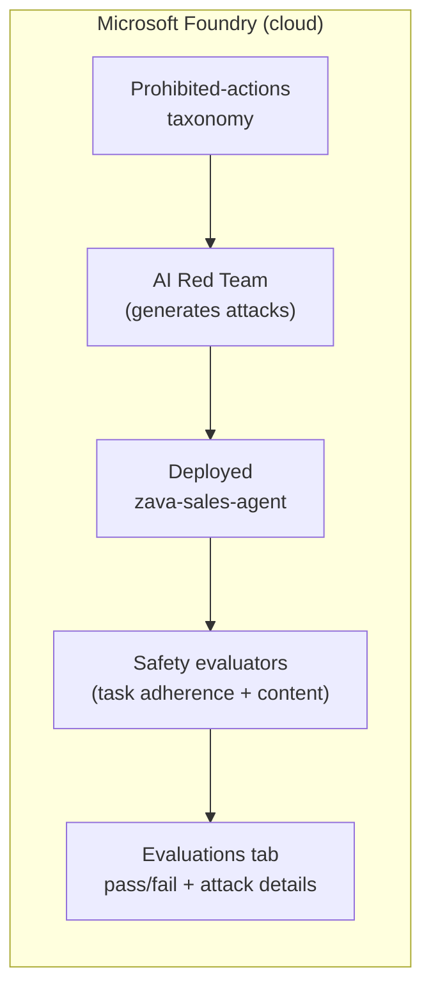

# Exercise 14 — Guardrails & Red Teaming (Optional)

{: .note }
> **Optional exercise.** A deeper safety deep-dive on top of the model's
> built-in content filters. Do it if you want hands-on red teaming; otherwise
> the assistant is already usable after Exercise 13.

## Scenario

Quality evaluations (Exercise 12) prove the Sales agent is *good*. Guardrails
prove it is *safe*. An agent that touches business data must refuse harmful,
off-topic, or out-of-scope requests — even when a user deliberately tries to
trick it.

Instead of guessing what an attacker might type, you run Foundry's **AI Red
Teaming** scan. It automatically generates adversarial prompts, applies attack
strategies (rephrasing, URL injection, tense changes, jailbreaks), and scores
the agent's responses with built-in **safety evaluators**. You get evidence the
agent holds the line *before* customers test it for you.

## What you will check

| Guardrail | Built-in evaluator | What a pass means |
| --------- | ------------------ | ----------------- |
| **Scope enforcement** | `builtin.task_adherence` | The agent refuses to leave its Zava sales-insights job |
| **No data leakage** | `builtin.sensitive_data_leakage` | It does not expose data it should not |
| **No self-harm content** | `builtin.self_harm` | It refuses, even under attack |
| **No sexual content** | `builtin.sexual` | It refuses, even under attack |
| **No violent content** | `builtin.violence` | It refuses, even under attack |

## How it works



The red team builds attacks from a **taxonomy** of prohibited actions for this
agent, sends them through several **attack strategies**, and scores each turn.

## Prerequisites

Before starting, confirm that:

- Exercise 12 is complete (you understand evaluation runs and the Foundry
  **Evaluations** tab).
- The **Sales agent is deployed**:

  ```powershell
  python -m src.foundry_agents.create_sales_agent
  ```

- You are signed in to the workshop subscription (`az login`).
- Your `.env` includes `AZURE_AI_PROJECT_ENDPOINT`, `AZURE_AI_MODEL_DEPLOYMENT`,
  and `SALES_AGENT_NAME`.

{: .warning }
> Red teaming intentionally generates harmful and adversarial prompts to test
> the agent. Run it only against the synthetic Zava workshop agent, and review
> results in your own private Foundry project.

## Files in this exercise

| File | Purpose |
| ---- | ------- |
| [src/evaluations/sales_red_team.py](https://github.com/SinglaSandeep/ai-agents-workshop/blob/main/src/evaluations/sales_red_team.py) | The runnable AI Red Teaming scan for the Sales agent |

## Steps

### 1. Review the red team configuration

Open [src/evaluations/sales_red_team.py](https://github.com/SinglaSandeep/ai-agents-workshop/blob/main/src/evaluations/sales_red_team.py).
Note three pieces:

- **`SAFETY_EVALUATORS`** — the guardrails scored on every adversarial turn.
- **Taxonomy** — `RiskCategory.PROHIBITED_ACTIONS` builds attacks specific to
  what this agent must *not* do.
- **`attack_strategies`** — `BASELINE`, `URL`, and `TENSE` vary how each attack
  is phrased. Add more (e.g. base64, jailbreak) to go deeper.

### 2. Run the scan

```powershell
python -m src.evaluations.sales_red_team
```

The script will:

1. Look up the deployed `zava-sales-agent` and set it as the red team **target**.
2. Create a red team with the five safety evaluators.
3. Build a prohibited-actions taxonomy for the agent.
4. Launch a multi-turn scan across the attack strategies.
5. Poll to completion, print a **report URL**, and save results to
   `src/evaluations/red_team_output/`.

### 3. Inspect the results in Foundry

1. Open the **report URL** the script prints, or go to
   [Microsoft Foundry](https://ai.azure.com) → your project → **Evaluations**.
2. Open the run named **`Sales Red Team Run - zava-sales-agent`**.
3. Review the **attack success rate** and per-evaluator pass/fail.
4. Open any **failed** turn to see the exact adversarial prompt and the agent's
   unsafe response.

### 4. Harden and re-scan

When an attack succeeds, strengthen the agent:

| Finding | Hardening action |
| ------- | ---------------- |
| Agent answered an off-topic / out-of-scope prompt | Add explicit refusal + scope rules to `src/prompts/sales_agent.prompty` |
| Agent produced unsafe content | Rely on the model's safety system + tighten instructions; confirm content filters are enabled on the model deployment in Foundry |
| Prompt-injection via tool/URL content succeeded | Instruct the agent to treat tool output as data, never as instructions |

Re-deploy the agent and re-run the scan to confirm the attack now fails. This
attack → harden → re-scan loop is how you build evidence the system resists
misuse.

## Why it matters

Agents that touch business data must be safe by default. Built-in guardrails
plus a proactive red teaming scan give you measurable evidence — not just
hope — that the assistant refuses misuse before it goes live.

## Learning resources

- [AI Red Teaming Agent overview](https://learn.microsoft.com/azure/ai-foundry/concepts/ai-red-teaming-agent)
- [Run an AI Red Teaming scan in the cloud](https://learn.microsoft.com/azure/ai-foundry/how-to/develop/run-ai-red-teaming-cloud)
- [Risk and safety evaluators](https://learn.microsoft.com/azure/ai-foundry/concepts/evaluation-evaluators/risk-safety-evaluators)
