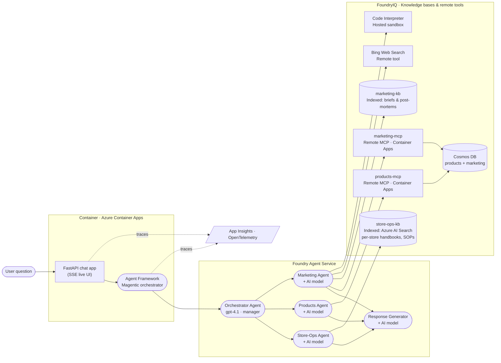

# Zava Reference Architecture

This page is the single source of truth for the end-to-end Zava
architecture you will build during the workshop. Every exercise wires up
one slice of this picture.

The layout matches the public **FoundryIQ + Agent Framework** reference
diagram, specialised to Zava's three business domains (Store-Ops,
Products, Marketing) plus a Response Generator that produces the final
user-facing answer.

---

## Architecture diagram

---

## How to read it (left → right)

1. **User question.** A store manager asks a question in the browser
   chat UI.
2. **Container · Azure Container Apps.** The FastAPI app receives the
   question and streams events back over Server-Sent Events. Embedded in
   the same process is the **Microsoft Agent Framework** Magentic
   orchestrator.
3. **Foundry Agent Service.** The Magentic orchestrator drives the
   hosted **Orchestrator Agent** (a `gpt-4.1`-powered *manager*) which
   plans the smallest set of specialist calls to satisfy the question
   and dispatches to:
   - **Store-Ops Agent** — handbooks, returns, safety, HR, SOPs.
   - **Products Agent** — catalog, inventory, pricing.
   - **Marketing Agent** — campaigns, KPIs, ROI, brand, live web.
4. **FoundryIQ · Knowledge bases & remote tools.** Each specialist is
   grounded in its own combination of indexed knowledge bases and
   remote tools:

   | Specialist          | Indexed KBs    | Remote tools                                          |
   | ------------------- | -------------- | ----------------------------------------------------- |
   | Store-Ops Agent     | `store-ops-kb` | —                                                     |
   | Products Agent      | —              | `products-mcp` (MCP) → Cosmos DB                      |
   | Marketing Agent     | `marketing-kb` | `marketing-mcp` (MCP) → Cosmos DB, Bing, Code Interp. |

5. **Response Generator.** Always called last; consolidates each
   specialist's transcript into one well-formatted reply that is shown
   back in the chat UI.
6. **Observability.** The container, orchestrator and Foundry agents
   all emit OpenTelemetry traces to **Application Insights** (wired up
   in Exercise 11).

> The browser UI at `http://localhost:8000` renders this same topology
> live: every node lights up as its agent / tool / KB is invoked, with
> SVG wires showing the active hand-offs (see
> [Exercise 07](07_orchestrator_agent_framework/07_orchestrator_agent_framework.md)).

---

## Component → Exercise map

| Architecture component                                | Built in                                                                                   |
| ----------------------------------------------------- | ------------------------------------------------------------------------------------------ |
| FastAPI chat app                                      | [Exercise 01](01_chat_app_scaffold/01_chat_app_scaffold.md)                                |
| `products-mcp` server + Cosmos seed                   | [Exercise 02](02_products_mcp_server/02_products_mcp_server.md)                            |
| Products Agent (Foundry)                              | [Exercise 03](03_products_foundry_agent/03_products_foundry_agent.md)                      |
| `marketing-mcp` server + Cosmos seed                  | [Exercise 04](04_marketing_mcp_server/04_marketing_mcp_server.md)                          |
| Marketing Agent + `marketing-kb` + Bing + Code Interp | [Exercise 05](05_marketing_foundry_agent/05_marketing_foundry_agent.md)                    |
| Store-Ops Agent + `store-ops-kb`                      | [Exercise 06](06_store_ops_foundry_iq_agent/06_store_ops_foundry_iq_agent.md)              |
| Magentic Orchestrator + live web UI                   | [Exercise 07](07_orchestrator_agent_framework/07_orchestrator_agent_framework.md)          |
| Response Generator                                    | [Exercise 08](08_response_generator/08_response_generator.md)                              |
| Evaluations                                           | [Exercise 09](09_evaluations/09_evaluations.md)                                            |
| Guardrails & red teaming                              | [Exercise 10](10_guardrails_red_teaming/10_guardrails_red_teaming.md)                      |
| App Insights · OpenTelemetry                          | [Exercise 11](11_observability/11_observability.md)                                        |
