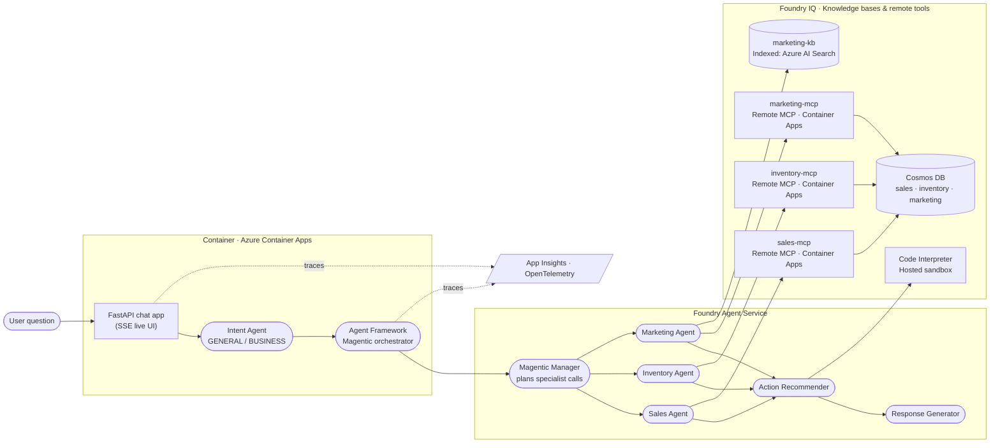

# Zava Reference Architecture

Single source of truth for the end-to-end architecture you'll build. It follows
the **Foundry IQ + Agent Framework** reference pattern, specialised to Zava's
**Sales**, **Inventory** and **Marketing** domains, with an **Intent**
classifier, **Action** recommender and **Response Generator**.

---

## Architecture diagram

---

## How to read it (left → right)

1. **User question.** A store manager asks a question in the browser
   chat UI.
2. **Container · Azure Container Apps.** The FastAPI app receives the
   question and streams events back over Server-Sent Events. The
   **Intent Agent** first classifies the turn as GENERAL (small talk) or
   BUSINESS; BUSINESS turns are handed to the **Microsoft Agent Framework**
   Magentic orchestrator embedded in the same process.
3. **Foundry Agent Service.** The Magentic **manager** plans the smallest
   set of specialist calls to satisfy the question and dispatches to:
   - **Sales Agent** — sales trends, revenue and category performance.
   - **Inventory Agent** — stock levels, warehouses and replenishment.
   - **Marketing Agent** — campaigns, KPIs, ROI and brand knowledge.
4. **Foundry IQ · Knowledge bases & remote tools.** Each specialist is
   grounded in its own combination of remote MCP tools and indexed
   knowledge:

   | Specialist        | Indexed KBs    | Remote tools                       |
   | ----------------- | -------------- | ---------------------------------- |
   | Sales Agent       | —              | `sales-mcp` (MCP) → Cosmos DB      |
   | Inventory Agent   | —              | `inventory-mcp` (MCP) → Cosmos DB  |
   | Marketing Agent   | `marketing-kb` | `marketing-mcp` (MCP) → Cosmos DB  |

5. **Action Recommender.** Runs after the specialists; uses the **Code
   Interpreter** to consolidate the cross-domain figures into a short,
   prioritised set of concrete actions.
6. **Response Generator.** Always called last; turns the orchestrator
   output into one well-formatted reply in a consistent Zava voice.
7. **Observability.** The container, orchestrator and Foundry agents all
   emit OpenTelemetry traces to **Application Insights** (Exercise 13).

> The browser UI at `http://localhost:8000` renders this same topology
> live as each agent and tool is invoked (see
> [Exercise 07](07_orchestrator/07_orchestrator.md)).

---

## Component → Exercise map

| Architecture component                       | Built in                                                                    |
| -------------------------------------------- | --------------------------------------------------------------------------- |
| FastAPI chat app                             | [Exercise 01](01_chat_app_scaffold/01_chat_app_scaffold.md)                 |
| Intent Agent                                 | [Exercise 02](02_intent_agent/02_intent_agent.md)                           |
| MCP tools (sales, inventory, marketing)      | [Exercise 03](03_mcp_tools/03_mcp_tools.md)                                 |
| Sales Agent (wired to `sales-mcp`)           | [Exercise 04](04_sales_agent/04_sales_agent.md)                             |
| Inventory Agent (wired to `inventory-mcp`)   | [Exercise 05](05_inventory_agent/05_inventory_agent.md)                     |
| Marketing Agent + KB (Foundry IQ)            | [Exercise 06](06_marketing_agent/06_marketing_agent.md)                     |
| Magentic Orchestrator + live web UI          | [Exercise 07](07_orchestrator/07_orchestrator.md)                           |
| Action Recommender + Code Interpreter        | [Exercise 08](08_action_agent/08_action_agent.md)                           |
| Response Generator                           | [Exercise 09](09_response_generator/09_response_generator.md)               |
| Deploy chat app                              | [Exercise 10](10_deploy_chat_app/10_deploy_chat_app.md)                     |
| Foundry hosted agents                        | [Exercise 11](11_hosted_agents/11_hosted_agents.md)                         |
| Evaluations                                  | [Exercise 12](12_evaluations/12_evaluations.md)                             |
| Observability · App Insights                 | [Exercise 13](13_observability/13_observability.md)                         |
| Guardrails & red teaming                     | [Exercise 14](14_guardrails_red_teaming/14_guardrails_red_teaming.md)       |
| Governance                                   | [Exercise 15](15_governance/15_governance.md)                               |
| Clean up                                     | [Exercise 16](16_cleanup/16_cleanup.md)                                     |
